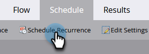

# 取消计划的定期批处理营销活动运行 {#cancel-a-scheduled-recurring-batch-campaign-run}

如果您有不希望再出现的经常性批处理活动，则可以取消将来的运行。 具体方法如下。

1. 选择智能营销活动，然后单击 **计划** 选项卡。

   

1. 单击 **计划周期性**.

   

   >[!TIP]
   >
   >您可以通过单击  旁边的。 了解如何 [取消计划的批处理营销活动运行](/help/marketo/product-docs/core-marketo-concepts/smart-campaigns/using-smart-campaigns/cancel-a-scheduled-batch-campaign-run.md).

1. 将计划设置为 **无** 并单击 **保存**.

   

   看！ 您的智能营销活动将不再运行。

   >[!CAUTION]
   >
   >这将取消未来的运行情况，但如果智能营销活动正在运行中，则无法取消它。

   >[!MORELIKETHIS]
   >
   >[取消计划的批处理营销活动运行](/help/marketo/product-docs/core-marketo-concepts/smart-campaigns/using-smart-campaigns/cancel-a-scheduled-batch-campaign-run.md)
