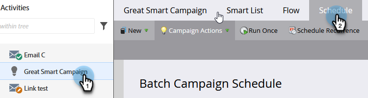

# 取消计划的定期批处理营销活动运行 {#cancel-a-scheduled-recurring-batch-campaign-run}

如果您有循环的批处理市场活动，并且不再需要它，则可以取消将来的运行。 具体方法如下。

1. 选择Smart Campaign并单击&#x200B;**计划**&#x200B;选项卡。

   

1. 单击&#x200B;**计划周期性**。

   

   >[!TIP]
   >
   >单击单个运行旁边的可取消该运行。 了解如何[取消计划的批处理营销活动运行](/help/marketo/product-docs/core-marketo-concepts/smart-campaigns/using-smart-campaigns/cancel-a-scheduled-batch-campaign-run.md){target="_blank"}。

1. 将计划设置为&#x200B;**[!UICONTROL 无]**&#x200B;并单击&#x200B;**[!UICONTROL 保存]**。

   

   看！ 您的Smart Campaign将不再运行。

   >[!CAUTION]
   >
   >这将取消将来的运行，但如果Smart Campaign正在运行中，则无法取消它。

   >[!MORELIKETHIS]
   >
   >[取消计划的批处理营销活动运行](/help/marketo/product-docs/core-marketo-concepts/smart-campaigns/using-smart-campaigns/cancel-a-scheduled-batch-campaign-run.md){target="_blank"}
