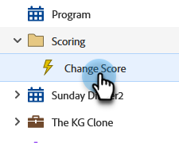

# 停用触发型智能营销活动 | 计划选项卡 {#deactivate-a-trigger-smart-campaign-schedule-tab}

如果您有需要取消激活的旧触发器促销活动，请执行以下步骤：

1. 查找并选择您活动的触发器促销活动。

   

1. 在“计划”选项卡下，单击&#x200B;**[!UICONTROL Deactivate]**。

   

1. 单击&#x200B;**[!UICONTROL Deactivate]**&#x200B;确认。

   

>[!NOTE]
>
>这将阻止&#x200B;_新_&#x200B;人员进入流，但处于等待步骤或任何其他流步骤的人员将继续通过流，直到完成为止。
