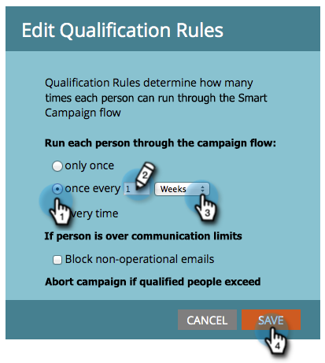

# 编辑智能营销活动中的资格规则 {#edit-qualification-rules-in-a-smart-campaign}

资格规则可控制某个人可在智能营销活动中流过的次数。 默认情况下，即使有人多次触发Smart Campaign，也只能通过流发送一次。 下面是如何修改这些设置的。

1. 在Smart Campaign中，单击&#x200B;**[!UICONTROL Schedule]**&#x200B;选项卡，然后单击&#x200B;**[!UICONTROL Edit Settings]**。

   

   >[!TIP]
   >
   >您还可以单击“Smart Campaign设置”右侧的&#x200B;**[!UICONTROL Edit]**。

1. 选择通过Smart Campaign流程运行人员的频率： **[!UICONTROL only once]**、**[!UICONTROL every time]**&#x200B;或&#x200B;**每隔#天**/**周**/**个月**&#x200B;运行一次。

   

   >[!NOTE]
   >
   >如果每天设置一次规则，Marketo会将该规则转换为小时数。 例如，如果您将规则设置为每天一次，而某个人在星期日夜间的晚上10点符合条件，则直到星期一夜间的晚上10点才能再次符合条件。 使用周或月时，此逻辑也适用。 一个月始终计为30天。

   >[!NOTE]
   >
   >默认情况下，通信限制不适用于智能营销活动。 了解如何[将通信限制应用于Smart Campaign](/help/marketo/product-docs/core-marketo-concepts/smart-campaigns/using-smart-campaigns/apply-communication-limits-to-smart-campaign.md){target="_blank"}。

   >[!NOTE]
   >
   >[将通信限制应用于智能营销活动](/help/marketo/product-docs/core-marketo-concepts/smart-campaigns/using-smart-campaigns/apply-communication-limits-to-smart-campaign.md){target="_blank"}

任务完成了！ 您现在知道如何在Smart Campaign中控制资格规则。
