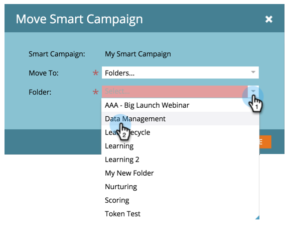

# 移动智能活动{#move-a-smart-campaign}

使用拖放或树中的移动功能在不同项目或文件夹之间移动智能活动。

## 使用拖放{#use-drag-and-drop}

1. 转至&#x200B;**营销活动**。

   

1. 选择智能活动，并将其拖放到新项目中。

   

   太棒了！ 这种聪明的活动现在已进入一个新的项目。 这也适用于文件夹。

   >[!NOTE]
   >
   >您的智能活动的规则不会更改 — 它将仅嵌套在其他位置。

## 使用移动功能{#use-the-move-feature}

也可以使用树中的移动功能移动智能活动。

1. 右键单击智能活动。 选择&#x200B;**移动**。

   

1. 在移至&#x200B;**项目**&#x200B;或&#x200B;**文件夹**&#x200B;之间进行选择。

   

1. 选择要移动的智能活动的特定位置。

   

1. 单击&#x200B;**移动**。

   

   五！ 此智能活动已移动。

   
