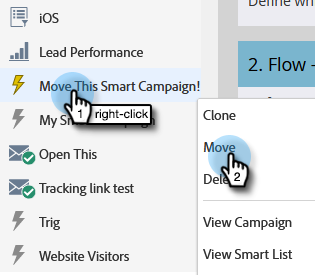

# 移动智能营销活动 {#move-a-smart-campaign}

使用拖放或树中的移动功能，在不同程序或文件夹之间移动Smart Campaign。 Smart Campaign的规则不会更改，只会嵌套到其他位置。

>[!CAUTION]
>
>由于规则不会更改，因此如果营销活动的智能列表或流程步骤引用原始项目，则必须手动更新该信息以反映其新项目，因为它将&#x200B;_不会_&#x200B;自动更新。

1. 前往 **[!UICONTROL Marketing Activities]**。

   

1. 找到要移动的Smart Campaign，右键单击并选择&#x200B;**[!UICONTROL Move]**。

   

1. 选择&#x200B;**[!UICONTROL To]** （目标）、**[!UICONTROL Program]**&#x200B;和可选的&#x200B;**[!UICONTROL Folder]**。 选择 **[!UICONTROL Move]**。

   

   >[!NOTE]
   >
   >在此示例中，Smart Campaign将移至其他项目，但您也可以将其移至Campaign文件夹。

已移动Smart Campaign。

