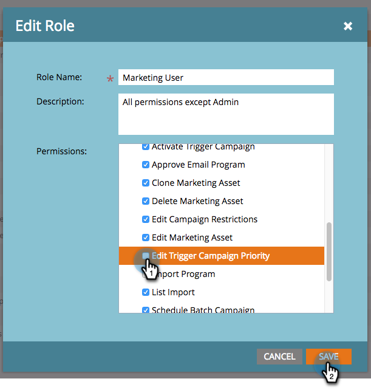

# 触发器促销活动的优先级覆盖 {#priority-override-for-trigger-campaigns}

管理员可以覆盖Marketo确定的优先级，以便触发营销活动，从而设置与业务目标更符合的优先级。

>[!NOTE]
>
>此功能仅适用于触发营销活动以及已获得 [“编辑触发器促销活动优先级”权限](#grant-priority-override-access).

>[!CAUTION]
>
>强烈建议您在一组有限的业务关键型营销活动上使用此功能（建议最大使用25次）。 在大型集合上松散地使用该功能，可能会对整体营销活动执行产生不利影响。

## 授予优先级覆盖访问权限 {#grant-priority-override-access}

>[!NOTE]
>
>只有具有管理员职责的管理员或用户才应具有营销活动优先级覆盖访问权限。

1. 在 [!UICONTROL 管理员] 区域，单击 **[!UICONTROL 用户和角色]**.

   

1. 单击 **[!UICONTROL 角色]** ，选择要授予访问权限的用户，然后单击 **[!UICONTROL 编辑角色]**.

   

1. 在 [!UICONTROL 访问营销活动]，选择 **[!UICONTROL 编辑触发器营销活动优先级]**. 单击 **[!UICONTROL 保存]**.

   

## 覆盖优先级 {#override-priority}

1. 找到您的触发器营销活动。 右键单击该页面并选择 **[!UICONTROL 覆盖营销活动优先级]**.

   

1. 单击 **[!UICONTROL 覆盖营销活动优先级]** 滑块启用。 选择新的优先级级别并单击 **[!UICONTROL 确认]**.

   

   新的优先级级别将显示在“计划”选项卡中。

   

>[!NOTE]
>
>* 您可以在 [!UICONTROL 促销活动队列] 在 [!UICONTROL 营销活动]. 要提高执行率，我们建议将营销活动优先级设置为比默认优先级高1个级别。
>* 用户集优先级仅适用于符合营销活动资格的新用户；已处于队列中的人员不会受到影响。
>* 优先级覆盖在 [审核记录](/help/marketo/product-docs/administration/audit-trail/audit-trail-overview.md).

