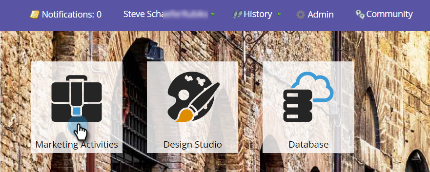

# 重命名智能营销活动 {#rename-a-smart-campaign}

您可以更改现有智能营销活动的名称。 这是方法。

1. 转到 **营销活动**.

   

1. 选择您的智能营销活动，然后单击其名称。

   

   >[!TIP]
   >
   >项目中的智能营销活动名称始终转换为“ProgramName.CampaignName”格式。

1. 输入新的智能营销活动名称并单击 **保存**.

   

   >[!NOTE]
   >
   >旧名称显示在选项卡中，并在保存时更改。

快，轻！ 任何引用智能营销活动的位置也会发生更改。
