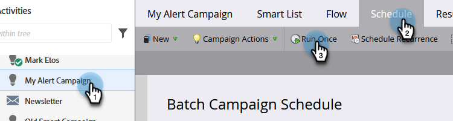

# 立即运行批量智能营销活动 |计划选项卡 {#run-a-batch-smart-campaign-now-schedule-tab}

完成批量营销活动的构建后，您可以选择立即或稍后运行它。 下面是如何立即运行它。

1. 选择批量智能营销活动，转到 **计划** 选项卡，单击 **运行一次**.

   

1. 确保 **立即运行** 选中并单击 **运行**.

   

1. 单击以确认 **运行** 再来一次。

   

   小菜一碟！ 您还可以 [计划稍后运行](/help/marketo/product-docs/core-marketo-concepts/smart-campaigns/using-smart-campaigns/schedule-a-batch-smart-campaign-to-run-later.md) 如果你愿意的话。

   >[!NOTE]
   >
   >* [计划批量智能营销活动以在以后运行](/help/marketo/product-docs/core-marketo-concepts/smart-campaigns/using-smart-campaigns/schedule-a-batch-smart-campaign-to-run-later.md)
   >* [计划定期批量促销活动](/help/marketo/product-docs/core-marketo-concepts/smart-campaigns/using-smart-campaigns/schedule-a-recurring-batch-campaign.md)

