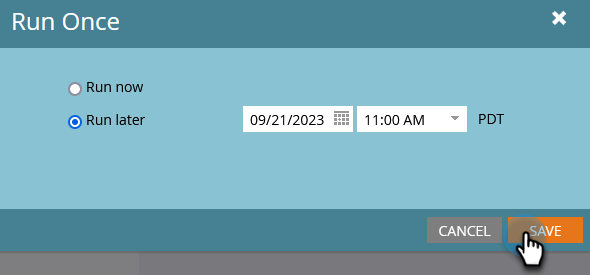

# 安排稍后运行的批量智能营销活动 {#schedule-a-batch-smart-campaign-to-run-later}

如果您希望将批量智能营销活动设置为在未来的某个时间点运行，请参阅下面的操作方法。

>[!TIP]
>
>您还可以 [在项目计划视图中重新计划批量智能营销活动](/help/marketo/product-docs/core-marketo-concepts/programs/program-schedule-view/reschedule-a-batch-smart-campaign-in-the-program-schedule-view.md).

1. 选择要运行的批处理智能营销活动，转到 **计划** 选项卡，然后单击 **运行一次**.

   

1. 单击 **稍后运行**，然后单击日历图标并选择您希望智能营销活动运行的日期。

   

1. 选择您希望智能营销活动在什么时间运行（至少提前15分钟）。

   

1. 单击 **保存**.

   

1. 您可以通过查看 **计划** 选项卡。

   

   >[!NOTE]
   >
   >[计划循环批处理活动](/help/marketo/product-docs/core-marketo-concepts/smart-campaigns/using-smart-campaigns/schedule-a-recurring-batch-campaign.md)
