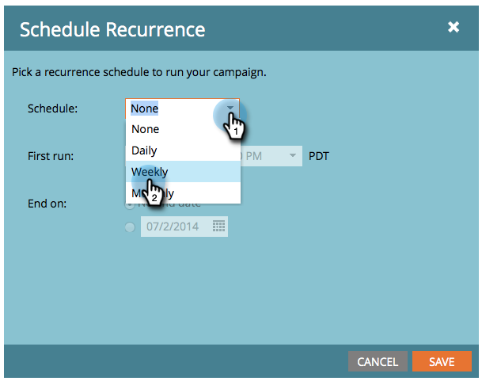

# 计划定期批量促销活动 {#schedule-a-recurring-batch-campaign}

循环允许您按常规计划运行批量智能营销活动。 例如 — 每周一次，周一中午12:00。

1. 选择营销活动，转到“计划”选项卡，然后单击 **计划重复**.

   

1. 单击计划下拉列表，然后选择 **每周**.

   

1. 单击日历图标，然后选择首次运行的日期。 在本例中，我们将使用下一个星期一提供的。

   

1. 选择运行该报表的时间。

   

1. 将Repeat every as 1保留为，选择星期一，然后单击 **保存**.

   

1. 您可以在计划选项卡下看到计划的重复项以进行验证。

   

>[!NOTE]
>
>“计划”选项卡将显示接下来的三个实例以供参考。

就这样！ 现在，您的批量营销活动将在每周一中午运行。
