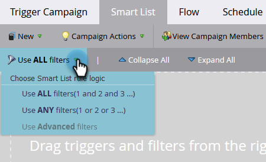

# 使用标准智能列表规则逻辑 {#using-standard-smart-list-rule-logic}

在构建Campaign智能列表时，您可能已经注意到“使用过滤器”选项。 通过此设置，可决定是需要使用AND运算符还是使用OR运算符来评估过滤器。



>[!NOTE]
>
>更改智能列表规则逻辑仅适用于筛选器， **非** 触发器。

触发器始终被评估为OR，即使上述设置被设置为ALL也是如此。 示例如下：


以上智能列表用词表示：

```box
IF person fills out Great Form
OR
IF person visits Keith's Landing Page 
AND 
Industry is Energy 
AND 
Country is US 
THEN follow the campaign's flow step(s)
```

所以，如果有人填写表格 **或** 访问页面，活动将根据以下条件评估该人员： **所有** 或 **任意** 的设置而定，具体取决于使用的设置。

>[!MORELIKETHIS]
>
>[使用高级智能列表规则逻辑](/help/marketo/product-docs/core-marketo-concepts/smart-lists-and-static-lists/using-smart-lists/using-advanced-smart-list-rule-logic.md)
