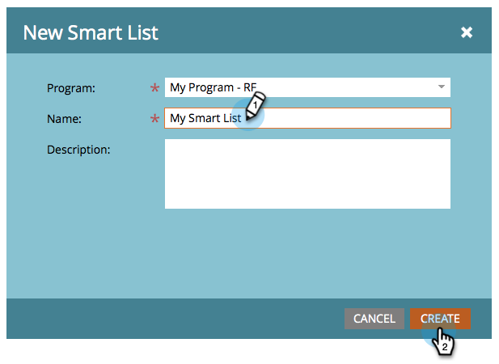

# 创建智能列表 {#create-a-smart-list}

利用智能列表，可使用简单筛选器查找特定的人员组。 以下是如何创建一个。

1. 转到 **营销活动**.

   

1. 选择要在其中创建智能列表的程序。

   

1. 下 **新**，单击 **新建本地资产**.

   

1. 选择 **智能列表**.

   

1. 输入 **名称** 并单击 **创建**.

   

   太棒了！ 现在，让我们添加和定义一些过滤器。

   >[!MORELIKETHIS]
   >
   >[查找筛选器并将其添加到智能列表](/help/marketo/product-docs/core-marketo-concepts/smart-lists-and-static-lists/creating-a-smart-list/find-and-add-filters-to-a-smart-list.md)
