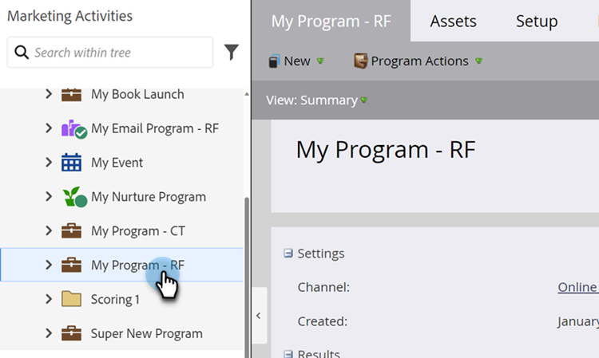

# 创建智能列表 {#create-a-smart-list}

智能列表允许您使用简单过滤器查找特定人员组。 以下是如何创建一个。

1. 转到&#x200B;**[!UICONTROL Marketing Activities]**。

   

1. 选择要在其中创建智能列表的程序。

   

1. 在&#x200B;**[!UICONTROL New]**&#x200B;下，单击&#x200B;**[!UICONTROL New Local Asset]**。

   

1. 选择 **[!UICONTROL Smart List]**。

   

1. 输入&#x200B;**[!UICONTROL Name]**&#x200B;并单击&#x200B;**[!UICONTROL Create]**。

   

   太棒了！ 现在，让我们添加和定义一些过滤器。

   >[!MORELIKETHIS]
   >
   >[查找筛选器并将其添加到智能列表](/help/marketo/product-docs/core-marketo-concepts/smart-lists-and-static-lists/creating-a-smart-list/find-and-add-filters-to-a-smart-list.md){target="_blank"}
