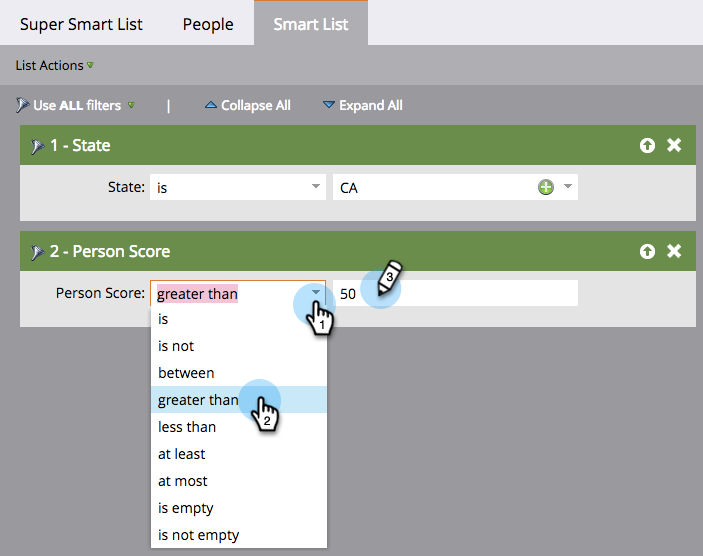

# 定义智能列表过滤器 {#define-smart-list-filters}

>[!PREREQUISITES]
>
>* [创建智能列表](create-a-smart-list.md)
>* [查找过滤器并将其添加到智能列表](find-and-add-filters-to-a-smart-list.md)

既然你 [已创建智能列表](/help/marketo/product-docs/core-marketo-concepts/smart-lists-and-static-lists/creating-a-smart-list/create-a-smart-list.md) 和 [添加过滤器](/help/marketo/product-docs/core-marketo-concepts/smart-lists-and-static-lists/creating-a-smart-list/find-and-add-filters-to-a-smart-list.md) 让我们定义过滤器。 这是方法。

继续我们的示例，让我们定义这些过滤器，以查找加利福尼亚所有得分超过50的人。

1. 转到 **营销活动**.

   

1. 选择智能列表，然后单击 **智能列表** 选项卡。

   

1. 查找并选择 **CA** 对于 **州** 过滤器。

   

   >[!NOTE]
   >
   >您可能同时存储了这两个 **加利福尼亚** 和 **CA**. 为了过滤这两个值并包括 _全部_ 加州人，学习如何  [向智能列表过滤器添加多个值](/help/marketo/product-docs/core-marketo-concepts/smart-lists-and-static-lists/using-smart-lists/add-multiple-values-to-a-smart-list-filter.md).

1. 选择 **大于** 运算符和输入 **50**.

   

>[!TIP]
>
>如果您认为数据库中的某些记录包含不完整的电子邮件地址(例如，仅“@adobe.com”)，请使用 **二** 使用“包含”运算符时的电子邮件地址过滤器。 一个过滤器包含“@adobe.com”，另一个过滤器包含“contains adobe.com”（不包含@符号）。

您现在知道如何创建智能列表和添加/定义过滤器。
