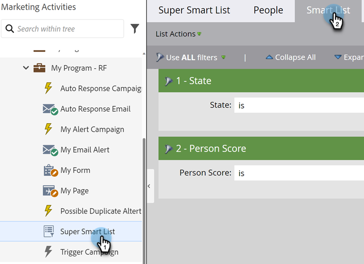

# 定义智能列表过滤器 {#define-smart-list-filters}

>[!PREREQUISITES]
>
>* [创建智能列表](/help/marketo/product-docs/core-marketo-concepts/smart-lists-and-static-lists/creating-a-smart-list/create-a-smart-list.md){target="_blank"}
>* [查找筛选器并将其添加到智能列表](/help/marketo/product-docs/core-marketo-concepts/smart-lists-and-static-lists/creating-a-smart-list/find-and-add-filters-to-a-smart-list.md){target="_blank"}

现在您已[创建智能列表](/help/marketo/product-docs/core-marketo-concepts/smart-lists-and-static-lists/creating-a-smart-list/create-a-smart-list.md){target="_blank"}并在其中添加了[筛选器](/help/marketo/product-docs/core-marketo-concepts/smart-lists-and-static-lists/creating-a-smart-list/find-and-add-filters-to-a-smart-list.md){target="_blank"}，请按照以下方式定义筛选器。

继续此示例，定义这些过滤器以查找得分超过50分的加利福尼亚州所有人员。

1. 前往 **[!UICONTROL Marketing Activities]**。

   

1. 选择所需的智能列表，然后单击&#x200B;**[!UICONTROL Smart List]**&#x200B;选项卡。

   

1. 为&#x200B;**[!UICONTROL State]**&#x200B;筛选器查找并选择“CA”。

   

   >[!NOTE]
   >
   >您可能同时存储了“加利福尼亚”和“CA”。 为了筛选这两个值并包括加利福尼亚的&#x200B;_所有_&#x200B;人员，了解如何[将多个值添加到智能列表筛选器](/help/marketo/product-docs/core-marketo-concepts/smart-lists-and-static-lists/using-smart-lists/add-multiple-values-to-a-smart-list-filter.md){target="_blank"}。

1. 选择&#x200B;**[!UICONTROL greater than]**&#x200B;运算符并输入“50”。

   

>[!TIP]
>
>如果您认为数据库中可能有一些记录包含不完整的电子邮件地址（例如，只有“@adobe.com”），请在使用“包含”运算符时使用两个电子邮件地址过滤器。 一个带有“contains @adobe.com”的过滤器，和一个带有“contains adobe.com”的单独过滤器（省略@符号）。

现在，您已了解如何创建智能列表并添加/定义筛选器。
