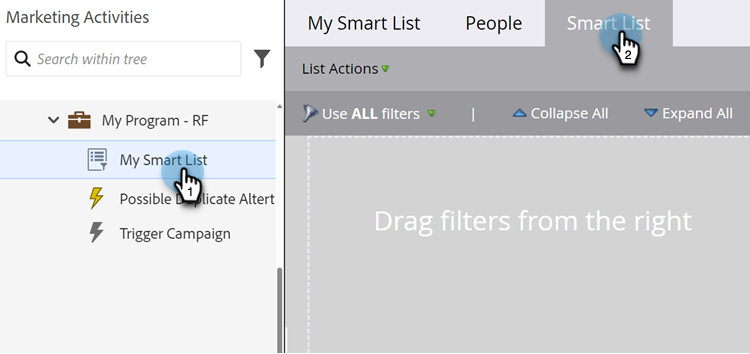

# 查找筛选器并将其添加到智能列表 {#find-and-add-filters-to-a-smart-list}

在您[创建智能列表](/help/marketo/product-docs/core-marketo-concepts/smart-lists-and-static-lists/creating-a-smart-list/create-a-smart-list.md){target="_blank"}后，您需要添加并[定义](/help/marketo/product-docs/core-marketo-concepts/smart-lists-and-static-lists/creating-a-smart-list/define-smart-list-filters.md){target="_blank"}筛选器。 以下是如何查找和添加过滤器。

在本例中，我们来查找加利福尼亚州得分超过50的所有人。

>[!TIP]
>
>浏览右侧的树 — 过滤器功能非常强大，并且可能具有多种功能。

1. 转到&#x200B;**[!UICONTROL 营销活动]**。

   

1. 选择要向其中添加过滤器的智能列表，然后单击&#x200B;**[!UICONTROL 智能列表]**&#x200B;选项卡。

   

1. 查找&#x200B;**[!UICONTROL 状态]**&#x200B;筛选器并将其拖动到画布上。

   

1. 同时查找并拖动&#x200B;**[!UICONTROL 分数]**&#x200B;筛选器。

   

完美！ 让我们继续定义这些过滤器。

>[!MORELIKETHIS]
>
>* [创建智能列表](/help/marketo/product-docs/core-marketo-concepts/smart-lists-and-static-lists/creating-a-smart-list/create-a-smart-list.md){target="_blank"}
>* [定义智能列表筛选器](/help/marketo/product-docs/core-marketo-concepts/smart-lists-and-static-lists/creating-a-smart-list/define-smart-list-filters.md){target="_blank"}
