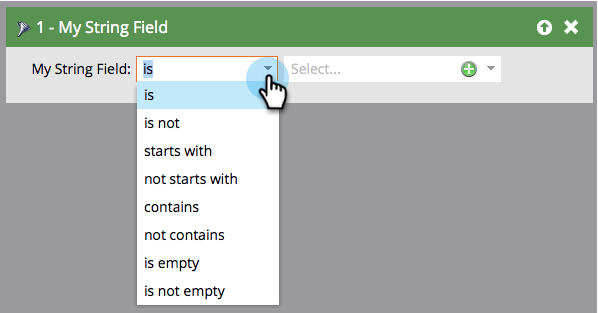

# 智能列表筛选器运算符术语表 {#smart-list-filter-operators-glossary}

运算符是智能列表的一部分，可帮助您获取特定内容。 它可让您以直截了当的语言描述过滤器或触发器。 每种类型的字段的可用运算符各不相同。

以下是一组术语表，用于描述每组运算符。

## 日期字段 {#date-fields}

当您选择运算符时，右侧将动态更改。

| 操作员 | 右侧 | 描述 |
|---|---|---|
| 是 | 单个日期 | 完全匹配的日期 |
| 不是 | 单个日期 | 除指定的日期之外的任何日期 |
| 介于两者之间 | 两个日期字段 | 包含两个指定日期且介于两个指定日期之间的任何日期 |
| 在过去 | 自然语言输入&#42; | 请参阅下图 |
| 在过去的时间之前 | 自然语言输入&#42; | 请参阅下图 |
| 在未来 | 自然语言输入&#42; | 请参阅下图 |
| 在未来时间之后 | 自然语言输入&#42; | 请参阅下图 |
| 在时间范围内 | 预设（上一季度、昨天等） | 在选取列表中定义 |
| 晚于 | 单个日期 | 指定日期之后的所有记录 |
| 早于 | 单个日期 | 指定记录之前的所有记录 |
| 在或晚于 | 单个日期 | 与“after”相同，但包含 |
| 在或早于 | 单个日期 | 与“之前”相同，但包含所有变量 |
| 为空 | 无 | 所有没有日期的记录 |
| 不为空 | 无 | 包含任何日期的所有记录 |

&#42; 自然语言输入很酷。 以下是您可以输入的一些模式：

* 1小时
* 82天
* 3周
* 14个月
* 1年

只要输入数字和单位就行了！

>[!NOTE]
>
>“过去” **是** 包括您创建智能列表的日期（直到时间，而不是之后）。

>[!CAUTION]
>
>使用日期字段过滤器创建智能列表（例如，出生日期、SFDC创建日期）并使用约束时 **早于**， **早于**，或 **过去的时间**&#x200B;中，智能列表还将包含在该日期字段中没有值的人员。

请使用下图来了解日期运算符之间的差异。

>[!NOTE]
>
>**示例**
>
>当您处理过去和未来的事件时，日期字段可能会变得很棘手。 下面是几个示例。
>
>**过去早于**
>
>对于新的促销活动，使用此运算符仅向一年内未订阅或续订您的服务或者从未订阅过的用户发送电子邮件。
>
>**以后的**
>
>假设您希望查看在90天内需要续订的客户。 您将使用两个单独的过滤器。 首先使用“In Future 90 Days”，然后使用“In Future 91 Days”。 这将捕获自现在90天后具有日期的人员。

## 字符串字段 {#string-fields}

| 操作员 | 描述 |
|---|---|
| 是 | 完全匹配（不区分大小写） |
| 不是 | 除了完全匹配项之外的任何内容 |
| 开头为 | 字符串匹配的前几个字母 |
| 未开始于 | 字符串的第一个字母不匹配 |
| 包含 | 字符串中放在一起的任何字母都匹配（例如：california、fortune、them） |
| 不包含 | 字符串中没有匹配的字母。 （“包含”的反向） |
| 为空 | 没有值(NULL)的记录 |
| 不为空 | 具有任意值的记录 |

>[!TIP]
>
>使用正运算符和负运算符。 “不是”过滤器必须搜索实例中的整个数据集，这可能非常耗时。 积极的“is”过滤器可以利用更有效的搜索算法。

## 整数字段 {#integer-fields}

<table> 
 <thead> 
  <tr> 
   <th colspan="1" rowspan="1">操作员</th> 
   <th colspan="1" rowspan="1">描述</th> 
  </tr> 
 </thead> 
 <tbody> 
  <tr> 
   <td colspan="1" rowspan="1">是</td> 
   <td colspan="1" rowspan="1">完全匹配的数量( = 0将返回两个具有0的销售机会 <em>和</em> NULL)</td> 
  </tr> 
  <tr> 
   <td colspan="1" rowspan="1">不是</td> 
   <td colspan="1" rowspan="1">除了精确数字匹配之外的任何内容</td> 
  </tr> 
  <tr> 
   <td colspan="1" rowspan="1">介于两者之间</td> 
   <td colspan="1" rowspan="1">定义两个值以查找介于两者之间的每个人（包括）</td> 
  </tr> 
  <tr> 
   <td colspan="1" rowspan="1">大于</td> 
   <td colspan="1" rowspan="1">高于指定的</td> 
  </tr> 
  <tr> 
   <td colspan="1" rowspan="1">小于</td> 
   <td colspan="1" rowspan="1">小于指定的</td> 
  </tr> 
  <tr> 
   <td colspan="1" rowspan="1">至少</td> 
   <td colspan="1" rowspan="1">高于指定的（包括）</td> 
  </tr> 
  <tr> 
   <td colspan="1" rowspan="1">最多</td> 
   <td colspan="1" rowspan="1">小于指定的（包括）</td> 
  </tr> 
  <tr> 
   <td colspan="1" rowspan="1">为空</td> 
   <td colspan="1" rowspan="1">没有值(NULL)的记录 — 零是一个数字，它是 <em>非</em> 空</td> 
  </tr> 
  <tr> 
   <td colspan="1" rowspan="1">不为空</td> 
   <td colspan="1" rowspan="1">具有ANY值（包括零）的记录</td> 
  </tr> 
 </tbody> 
</table>

如您所见，这些操作员可以轻松地说流利的Marketo语！
