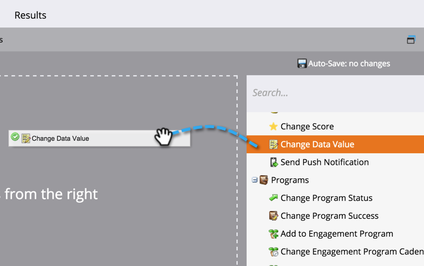
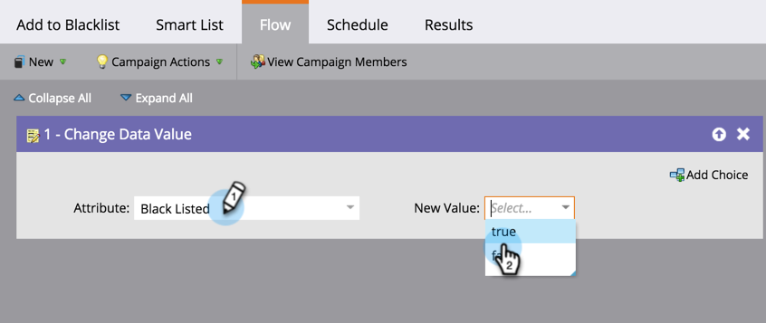

# 添加人阻止列表员以{#add-person-to-blocklist}

在您的中添阻止列表加人员会阻止他们收到您的信件。

>[!NOTE]
>
>Marketo正在更改黑名单和白名单等术语，以在我们的产阻止列表品中允许列表和。 在此更新过程中，您可能会在我们的UI和文档屏幕截图中看到旧条款，在我们的文档文本中看到新条款。 我们为任何混乱表示歉意。

1. [新建一个默认程](/help/marketo/product-docs/core-marketo-concepts/programs/creating-programs/create-a-program.md) 序，并将其命 **名为“添阻止列表加”**。

1. 单击&#x200B;**新建**，然后选择&#x200B;**新建本地资产**。

   

1. 命名列表，然后单击&#x200B;**创建**。

   

1. 将所有人添加到您的&#x200B;**智能列表**&#x200B;中，以添加到您的阻止列表。

   >[!NOTE]
   >
   >您的人阻止列表员将不会收到操作电子邮件。

   

1. 单击&#x200B;**新建**，然后选择&#x200B;**新建智能活动**。

   

1. 将&#x200B;**命名为“新建智能活动**”。 单击&#x200B;**创建**。

   

1. 拖放&#x200B;**智能列表成员**。

   

1. 选择刚刚创建的智能列表。

   

1. 拖放&#x200B;**更改数据值**。

   

1. 对于&#x200B;**Flow**，为&#x200B;**Attribute**&#x200B;输入&#x200B;**Block Listed**，并将&#x200B;**New Value**&#x200B;设置为&#x200B;**true**。

   

1. 在&#x200B;**计划**&#x200B;选项卡上，选择&#x200B;**运行一次**。

   

1. 选择&#x200B;**立即运行**，然后单击&#x200B;**运行**。

   

   耶！ 这些人不会再收到电子邮件。

   >[!TIP]
   >
   >使用&#x200B;**更改活动值**（**列出的块为true**）为将来具有可属性的所有人创建[触发智能](/help/marketo/product-docs/core-marketo-concepts/smart-campaigns/creating-a-smart-campaign/create-a-new-smart-campaign.md)阻止列表。
