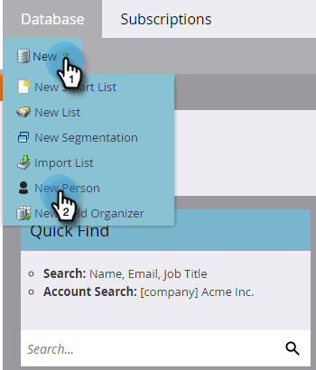

# 手动创建人员 {#create-a-person-manually}

可以通过多种方式将人员导入Marketo Engage。 要手动创建一个，请执行以下步骤。

>[!CAUTION]
>
>Marketo不支持包含表情符号的电子邮件地址。

1. 转到&#x200B;**[!UICONTROL Database]**。

   

1. 在&#x200B;**[!UICONTROL New]**&#x200B;下，单击&#x200B;**[!UICONTROL New Person]**。

   

1. 输入人员信息，然后单击&#x200B;**[!UICONTROL Create]**。

   
