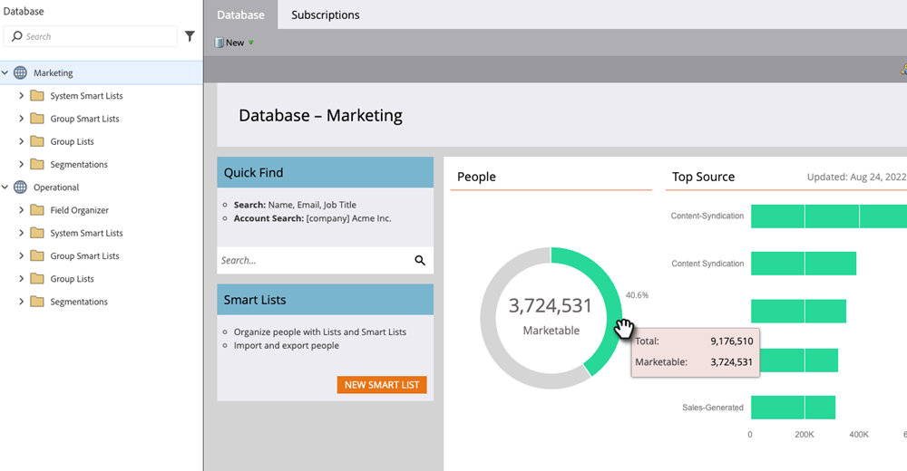

# 数据库仪表板 {#database-dashboard}

数据库仪表板用作快照，帮助您快速确定有关工作区中人员的关键属性。

>[!NOTE]
>
>* 数据库仪表板每24-32小时自动更新一次。 您可以随时通过单击屏幕右侧的“上次更新”文本来执行手动更新。
>
>* 每个工作区都有自己的数据库功能板。

要到达该位置，请从“我的Marketo”中选择&#x200B;**[!UICONTROL Database]**。

这些图表显示总人数、有销路的人员数量以及排名前五的人员获取来源。 将鼠标悬停在绿色区域上以了解更多详细信息。

>[!TIP]
>
>有关您员工的更具体或及时的信息，请尝试[员工绩效报表](/help/marketo/product-docs/reporting/basic-reporting/report-types/people-performance-report.md){target="_blank"}。

**总人数：**&#x200B;列出的工作区所有时间的人数。

**可营销的人员：**&#x200B;列出的工作区所有时间联系人的数量，_减去以下各项_：没有电子邮件地址的人员、电子邮件已硬退信的人员、已列入阻止列表的人员、已取消订阅的人员、当前设置为“营销已暂停”的人员。
