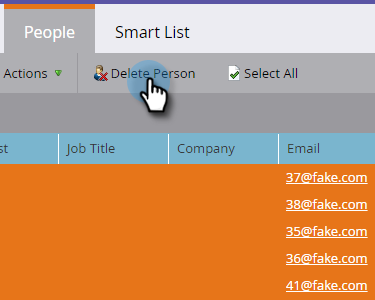

# 在智能列表或列表{#delete-people-in-a-smart-list-or-list}中删除人物

您可以快速轻松地删除处于列表或智能列表中的部分/所有人。

>[!PREREQUISITES]
>
>[创建智能列表](/help/marketo/product-docs/core-marketo-concepts/smart-lists-and-static-lists/creating-a-smart-list/create-a-smart-list.md)

1. 转至&#x200B;**营销活动**。

   

1. 选择包含所有要删除的人员的列表/智能列表，并转到&#x200B;**人员**&#x200B;选项卡。

   

   >[!CAUTION]
   >
   >删除人员时，您不仅会从列表中删除他们，还会从数据库中完全删除他们。

1. 单击&#x200B;**选择全部**。 您还可以使用Ctrl/Cmd并单击手动选取一些记录。

   

   >[!NOTE]
   >
   >如果结果跨多个页面，则单击&#x200B;**全选**&#x200B;将选择所有页面中的所有人。

1. 要从Marketo中完全删除人员，请单击&#x200B;**删除人员**。

   

1. 如果您也要从CRM中删除记录，请将&#x200B;**从CRM**&#x200B;删除设置为&#x200B;**true**。

   

   >[!CAUTION]
   >
   >从Marketo和您的CRM中删除意味着您将永远无法在任一系统中恢复。 人民和他们的历史将永远消失。 如果稍后再添加，它们将被视为全新记录。

   >[!NOTE]
   >
   >如果您的Marketo未绑定到您的CRM，则选项将像屏幕截图中一样灰显。

1. 单击&#x200B;**立即运行**。

   

1. 如果删除的人数超过50人，您会看到此内容。 键入要删除的人数，选中&#x200B;**无法撤消**&#x200B;框，然后单击&#x200B;**删除**。

   

   >[!NOTE]
   >
   >要视图质量删除的结果，请在屏幕右上角的“单流操作”弹出框中单击“视图结果”****。 删除时间可能会有很大不同，具体取决于多个因素。

   这是一个很棒的功能，使用时要非常小心！
