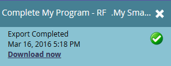

# 将列表或智能列表中的人员导出到 Excel {#export-people-to-excel-from-a-list-or-smart-list}

如果您需要Marketo之外的列表或智能列表结果，可以轻松导出到Excel。 操作方法如下：

1. 转到&#x200B;**[!UICONTROL Marketing Activities]**。

   

1. 选择要导出的列表或智能列表，然后转到&#x200B;**[!UICONTROL People]**&#x200B;选项卡。

   

1. 单击页面底部的Excel图标。

   

1. 选择 **[!UICONTROL Visible Columns]** 并点击 **[!UICONTROL Export]**。

   

   >[!NOTE]
   >
   >如果选择&#x200B;**[!UICONTROL All Columns]**，则导出的大小会更大，生成/下载所需的时间也会更长。

   >[!TIP]
   >
   >如果您的人员记录包含导出时无法正确呈现的外来字符，请尝试在&#x200B;**[!UICONTROL Format]**&#x200B;下拉菜单中更改文件类型。

1. 将运行导出。 完成后，您可以单击&#x200B;**[!UICONTROL Download now]**&#x200B;以获取文件。

   

   >[!TIP]
   >
   >如果导出需要一段时间，您始终可以注销并稍后返回导出。 在&#x200B;**[!UICONTROL Download now]**&#x200B;菜单中选择&#x200B;**[!UICONTROL Show Export Status]**&#x200B;即可访问&#x200B;**[!UICONTROL List Actions]**&#x200B;链接，该链接的有效期为一周。
