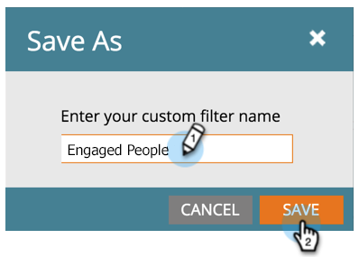

# 在人员{#filter-activity-types-in-the-activity-log-of-a-person}的活动日志中筛选活动类型

在活动日志中搜索对您最重要的活动。

>[!NOTE]
>
>了解有关[活动日志](/help/marketo/product-docs/core-marketo-concepts/smart-lists-and-static-lists/managing-people-in-smart-lists/locate-the-activity-log-for-a-person.md)的更多信息。

1. 转到&#x200B;**人员详细信息**&#x200B;页面。 单击&#x200B;**活动日志**&#x200B;选项卡。

   

1. 选择&#x200B;**Filter**&#x200B;下拉列表。

   

## 创建自定义过滤器{#creating-custom-filters}

1. 单击&#x200B;**Filter**&#x200B;下拉列表。 选择&#x200B;**自定义**。

   

1. 选择要筛选的活动。 单击&#x200B;**另存为**。

   

1. 输入&#x200B;**自定义筛选器名称**。 单击&#x200B;**保存**。

   

   现在，只显示符合筛选条件的人员活动。

   

## 引用保存的过滤器{#reference-saved-filters}

保存的过滤器可从&#x200B;**Filter**&#x200B;下拉列表访问。

1. 单击&#x200B;**过滤器**&#x200B;下拉列表。 选择&#x200B;**自定义**。

   

1. 单击&#x200B;**保存的过滤器**。 保存的过滤器列在下面。

   
