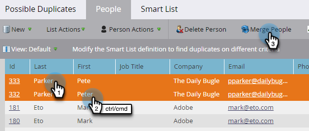

# 查找并合并重复的人员 {#find-and-merge-duplicate-people}

当新用户进入系统时，Marketo Engage会自动删除重复项。 但是，您的CRM最初可能通过重复项发送。 下面是如何将它们合并的。

>[!CAUTION]
>
>合并人员是永久性的，没有“撤消”选项。

>[!PREREQUISITES]
>
>查找和合并重复项需要使用[内置/系统智能列表](/help/marketo/product-docs/core-marketo-concepts/smart-lists-and-static-lists/using-smart-lists/use-built-in-system-smart-lists.md){target="_blank"}。

>[!NOTE]
>
>Marketo不会针对[!DNL Salesforce]或[!DNL Microsoft Dynamics]同步自动执行重复数据删除，或者在您手动输入人员时执行重复数据删除。

## 查找重复项 {#find-duplicates}

1. 转到&#x200B;**[!UICONTROL Database]**&#x200B;区域。

   

   >[!CAUTION]
   >
   >如果您使用[!DNL Salesforce]人员帐户，在Marketo中合并人员可能无法工作。 如果可能，请合并[!DNL Salesforce]中的记录。

1. 选择&#x200B;**[!UICONTROL Possible Duplicates]**&#x200B;系统智能列表，然后单击&#x200B;**[!UICONTROL People]**&#x200B;选项卡。

   

   >[!NOTE]
   >
   >您还可以[使用自定义逻辑](/help/marketo/product-docs/core-marketo-concepts/smart-lists-and-static-lists/managing-people-in-smart-lists/find-duplicate-people-with-custom-logic.md){target="_blank"}查找重复的人员。

## 手动合并人员 {#merge-people-manually}

>[!CAUTION]
>
>在合并人员时，如果落选人员具有Marketo自定义对象，则将&#x200B;_不_&#x200B;与入选人员重新关联。 在执行合并之前，请重新为自定义对象添加父级。

1. 按住Ctrl/Cmd并单击，然后单击&#x200B;**[!UICONTROL Merge People]**&#x200B;以选择重复项。

   

   >[!TIP]
   >
   >您可以为同一人员创建两个或多个重复项 — 一次选择所有重复项。

1. 您将看到&#x200B;_不符合_&#x200B;的记录之间的值。 为每个字段选择要保留的值。 完成后单击&#x200B;**[!UICONTROL Merge]**。 如果您不需要这两个值，可以选中&#x200B;**[!UICONTROL Custom]**&#x200B;并输入您选择的值。

   

   >[!NOTE]
   >
   >手动合并人员时，第一个被选中的人员将成为“入选者”。 在“人员”选项卡中，如果您要合并记录ID 198和199，并且碰巧首先单击199，则199将是合并人员的记录ID。 如果合并了两个以上的记录，这也适用。

   >[!TIP]
   >
   >合并总比删除好。 您将保留所有历史记录（页面访问次数、链接点击次数、电子邮件打开次数、表单填写次数等）。

## Salesforce中的效果 {#effect-in-salesforce}

如果您集成了Salesforce，下面是有关在Salesforce中合并潜在客户的影响的一些注释。

* 仅合并潜在客户或仅合并联系人时，它们会按照常规[!DNL Salesforce]规则合并。
* 将Lead和Contacts合并在一起时，所有Lead在按照常规[!DNL Salesforce]规则合并之前都会转换为Contacts。

有关合并潜在客户或联系人时Salesforce行为的详细信息，请检查以下[!DNL Salesforce]文档：

* [正在合并重复的潜在客户](https://help.salesforce.com/HTViewHelpDoc?id=leads_merge.htm&language=en_US){target="_blank"}
* [正在合并重复的联系人](https://help.salesforce.com/HTViewHelpDoc?id=contacts_merge.htm&language=en_US){target="_blank"}

## 批量合并 {#bulk-merging}

如果您要手动合并的重复项过多，请联系Adobe客户团队（您的客户经理）以讨论相关选项。
