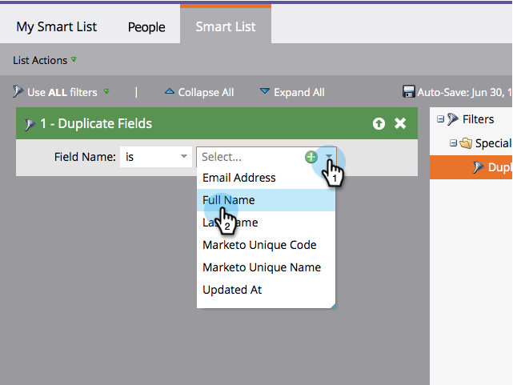

# 使用自定义逻辑查找重复的人员 {#find-duplicate-people-with-custom-logic}

Marketo有一个系统智能列表，用于通过匹配重复人员的电子邮件地址来查找重复的人员。 如果要使用其他字段查找重复项，请参阅以下方法。

>[!PREREQUISITES]
>
>[创建智能列表](/help/marketo/product-docs/core-marketo-concepts/smart-lists-and-static-lists/creating-a-smart-list/create-a-smart-list.md)

1. 转到 **营销活动** 区域。

1. 选择您的智能列表，单击 **智能列表** 选项卡。

   

1. 查找并拖动 **重复字段** 过滤到画布上。

   

1. 从四个可用选项中选择一个：

   * 电子邮件地址
   * 全名
   * 姓氏
   * 更新时间

   >[!NOTE]
   >
   >除电子邮件地址外，所有字段都区分大小写。 因此，在“全名”字段中使用“john doe”将会 _非_ 返回John Doe的结果。

   

   完成! 运行智能列表以查找在之前选定的字段中具有相同值的用户。
