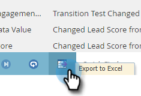

# 查找人员的活动日志 {#locate-the-activity-log-for-a-person}

活动日志是最终的真实来源。 这是一个人在Marketo历程的完整故事。

1. 转到 **数据库**.

   

1. 选择 **所有人员**.

   

1. 单击 **人员** 选项卡。 选择人员 **Id** 数字。

   

1. 单击 **活动日志**.

   

   现在，您已经收集了某个人在一段时间内发生的所有信息。

   

## 导出活动日志 {#export-activity-log}

是否需要将人员的活动日志导出到Excel？

1. 按照上述步骤操作后，滚动到页面底部，并选择导出图标。

   

1. Excel文件将下载到您的浏览器。

   

   >[!MORELIKETHIS]
   >
   >了解有关 [筛选活动日志](/help/marketo/product-docs/core-marketo-concepts/smart-lists-and-static-lists/managing-people-in-smart-lists/filter-activity-types-in-the-activity-log-of-a-person.md) 查看特定人员活动。
