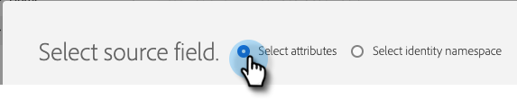
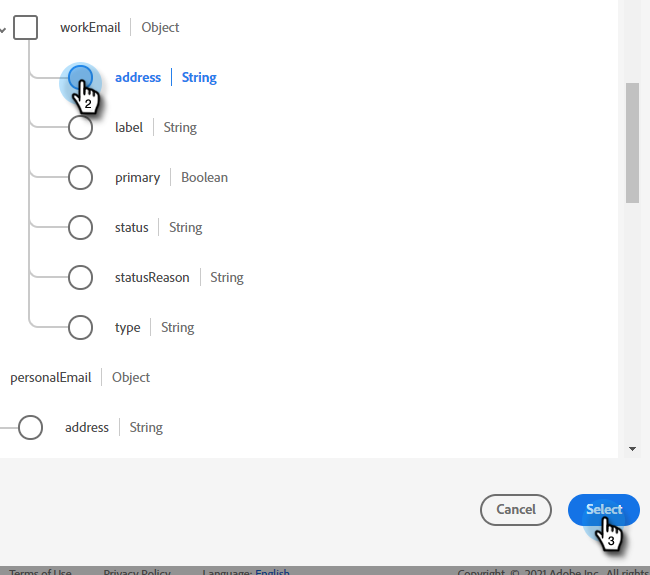

# 将Adobe Experience Platform区段推送到Marketo静态列表 {#push-an-adobe-experience-platform-segment-to-a-marketo-static-list}

此功能允许您以静态列表的形式将位于Adobe Experience Platform中的区段推送到Marketo。

>[!PREREQUISITES]
>
>* [在Marketo中创](/help/marketo/product-docs/administration/users-and-roles/create-an-api-only-user.md) 建API用户。
>* 然后，转到&#x200B;**Admin** > **Launchpoint**。 找到您刚刚创建的角色的名称，然后单击&#x200B;**查看详细信息**。 复制并保存&#x200B;**客户端ID**&#x200B;和&#x200B;**客户端密钥**&#x200B;中的信息，因为您需要它才能使用此功能。

1. 登录到[Adobe Experience Platform](https://experience.adobe.com/)。

   

1. 单击网格图标，然后选择&#x200B;**Experience Platform**。

   

1. 在左侧导航中，单击&#x200B;**目标**。

   

1. 单击&#x200B;**Catalog**。

   

1. 找到Marketo Engage拼贴，然后单击&#x200B;**激活区段**。

   

1. 单击&#x200B;**配置新目标**。

   PICC

1. 在“Account Type（帐户类型）”下，单击&#x200B;**New Account**（新建帐户）单选按钮。 输入您的Marketo凭据，然后单击&#x200B;**连接到目标**。

   

   >[!NOTE]
   >
   >您可以通过转到&#x200B;**Admin** > **Munchkin**(登录后，它也是Marketo URL的一部分)来查找Munchkin ID。 客户端ID/密钥您应当具有，以便遵循本文顶部的先决条件。

1. “已连接”应显示在您的凭据下方。 单击右上角的&#x200B;**Next**。

   

1. 输入&#x200B;**名称**&#x200B;和&#x200B;_可选_&#x200B;描述。 单击&#x200B;**创建目标**。

   >[!NOTE]
   >
   >从营销操作中选择某些内容也是可选的。 Marketo目前不利用这些信息，但很可能很快会利用。

   

1. 单击&#x200B;**Next**。

   

1. 选择所需的区段，然后单击&#x200B;**下一步**。

   

   >[!NOTE]
   >
   >静态列表的区段为1:1。 如果在此处选择多个区段，则必须在区段计划选项卡中将每个区段映射到指定的静态列表。

1. 单击&#x200B;**添加新映射**。

   

1. 单击光标图标。

   

1. 选择&#x200B;**选择属性**&#x200B;或&#x200B;**选择身份命名空间**&#x200B;单选按钮（在本例中，我们选择属性）。

   

   >[!NOTE]
   >
   >如果选择了&#x200B;**选择身份命名空间**，则在进行选择后，跳到步骤15。

1. 选择包含标识用户的电子邮件地址的相关字段。 完成后，单击&#x200B;**选择**。

   

   

   >[!NOTE]
   >
   >我们选择的示例可能与您选择的示例有很大不同。

1. 单击映射图标。

   

1. 选择目标字段，然后单击&#x200B;**选择**。

   

1. 单击&#x200B;**Next**。

   

   >[!NOTE]
   >
   >标识用于在Marketo中查找匹配项。 如果找到匹配项，则会将人员添加到静态列表。 如果未找到匹配项，则会删除这些人员(即，未在Marketo中创建)。

1. _在Marketo_&#x200B;中，创建一个静态列表，或查找并选择一个已创建的列表。复制URL末尾的映射ID。

   

   >[!NOTE]
   >
   >为获得最佳结果，请确保您在Marketo中引用的列表为空。

1. 返回Adobe Experience Platform，输入您刚才复制的ID。 选择开始日期。 在选定的结束日期之前，用户将持续同步。 对于无限同步，请将结束日期留空。 完成后，单击&#x200B;**Next**。

   

1. 确认更改并单击&#x200B;**完成**。

   
