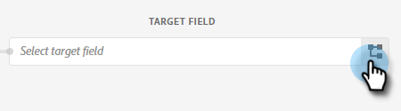
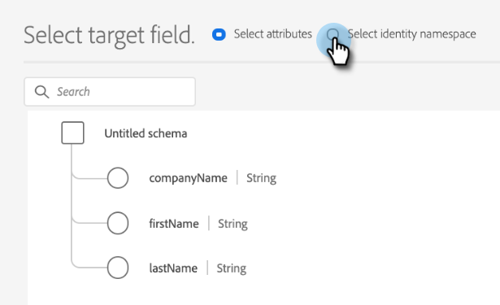

# 推送克隆 {#push-clone}

此功能允许您以静态列表的形式将位于Adobe Experience Platform中的区段推送到Marketo。

>[!PREREQUISITES]
>
>* [创建API用户](/help/marketo/product-docs/administration/users-and-roles/create-an-api-only-user.md) 在Marketo。
>* 然后，转到 **管理员** > **Launchpoint**. 查找您刚刚创建的角色的名称，然后单击 **查看详细信息**. 复制信息并将其保存在 **客户端ID** 和 **客户端密钥**，因为您将需要它才能使用此功能。

1. 登录到 [Adobe Experience Platform](https://experience.adobe.com/).

   

1. 单击网格图标，然后选择 **Experience Platform**.

   

1. 在左侧导航栏中，单击 **目标**.

   

1. 单击 **目录**.

   

1. 查找Marketo Engage拼贴并单击 **激活区段**.

   

1. 单击 **配置新目标**.

1. 在“帐户类型”下，选择“现有帐户”或 **新帐户** 单选按钮(在本例中，我们选择 **新帐户**)。 输入您的Marketo凭据。

   

   >[!NOTE]
   >
   >您可以通过以下路径找到您的Munchkin ID: **管理员** > **蒙奇金** (登录后，它也会成为Marketo URL的一部分)。 客户端ID/密钥您应当具有，以便遵循本文顶部的先决条件。

1. 在“人员创建”下，选择“仅匹配现有人员”或“在Marketo中匹配现有人员并创建缺失人员”。 在这个选项中，我们选择的是后者。

PICC

1. “已连接”应显示在您的凭据下方。 单击 **下一个** 在右上角。

   

1. 输入 **名称** 和 _可选_ 描述。 单击 **创建目标**.

   >[!NOTE]
   >
   >从营销操作中选择某些内容也是可选的。 Marketo目前不利用这些信息，但很可能很快会利用。

   

1. 单击 **下一个**.

   

1. 选择所需的区段并单击 **下一个**.

   

   >[!NOTE]
   >
   >如果在此处选择多个区段，则必须在区段计划选项卡中将每个区段映射到指定的静态列表。

1. 单击 **添加新映射**.

   

1. 单击光标图标。

   

1. 选择 **选择属性** 或 **选择身份命名空间** 单选按钮（在本例中，我们选择的是“属性”）。

   

   >[!NOTE]
   >
   >如果您选择 **选择身份命名空间**，则跳到步骤15。

1. 选择包含标识用户的电子邮件地址的相关字段。 单击 **选择** 完成时。

   

   

   >[!NOTE]
   >
   >我们选择的示例可能与您选择的示例有很大不同。

1. 单击映射图标。

   

1. 选择 **选择身份命名空间**.

   

   >[!IMPORTANT]
   >
   >映射属性是可选的。 从映射电子邮件和/或ECID **身份命名空间** 选项卡是确保人员在Marketo中进行匹配时最重要的操作。 映射电子邮件将确保最高匹配率。

1. 在ECID或电子邮件之间进行选择。 在本例中，我们选择 **电子邮件**.

   

1. 单击 **下一个**.

   

   >[!NOTE]
   >
   >标识用于在Marketo中查找匹配项。 如果找到匹配项，则会将人员添加到静态列表。 如果未找到匹配项，则会删除这些人员(即，未在Marketo中创建)。

1. _在Marketo_、创建静态列表，或查找并选择已创建的列表。 复制URL末尾的映射ID。

   

   >[!NOTE]
   >
   >为获得最佳结果，请确保您在Marketo中引用的列表为空。

1. 返回Adobe Experience Platform，输入您刚才复制的ID。 选择开始日期。 在选定的结束日期之前，用户将持续同步。 对于无限同步，请将结束日期留空。 单击 **下一个** 完成时。

   

1. 确认更改并单击 **完成**.

   
