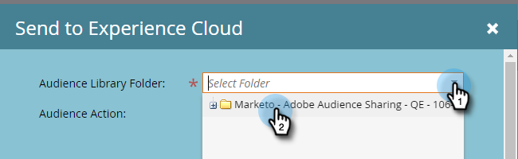
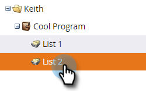

# 将列表发送到Adobe Experience Cloud {#send-a-list-to-adobe-experience-cloud}

>[!NOTE]
>
>Marketo实例的HIPAA就绪部署无法使用此功能。

>[!PREREQUISITES]
>
>[设置Adobe组织映射](/help/marketo/product-docs/adobe-experience-cloud-integrations/set-up-adobe-organization-mapping.md){target=&quot;_blank&quot;}

## 支持的目标应用程序 {#supported-destination-applications}

* Adobe Advertising Cloud
* Adobe Analytics(**仅** 如果您拥有Adobe Audience Manager许可证)
* Adobe Audience Manager
* Adobe Experience Manager
* Adobe Real-time Customer Data Platform
* Adobe Target

## 如何发送静态列表 {#how-to-send-a-static-list}

静态列表就是静态列表。 除非您手动进行更改，否则不会对Adobe Experience Cloud中的列表进行任何更改。

1. 在Marketo中，找到要导出的列表。 右键单击该页面并选择 **发送到Experience Cloud**.

   

1. 单击 **Audience Manager文件夹** 下拉菜单，然后在Experience Cloud中选择所需的目标文件夹。

   

1. 选择是创建新受众还是覆盖现有受众（在本例中，我们将创建一个新受众）。 输入新受众名称，然后单击 **发送**.

   

1. 单击 **确定**.

   

   >[!NOTE]
   >
   >要完全填充Adobe，受众会员资格最多可能需要6-8小时。

## 如何发送同步列表 {#how-to-send-a-synced-list}

同步列表意味着每当您在Marketo中更新列表时，该更改都会自动同步到Adobe Experience Cloud中的受众。

1. 在Marketo中，找到要导出的列表。 右键单击该页面并选择 **发送到Experience Cloud**.

   

1. 单击 **受众库文件夹** 下拉菜单，然后在Experience Cloud中选择所需的目标文件夹。

   

1. 选择是创建新受众还是覆盖现有受众（在本例中，我们将创建一个新受众）。 输入新受众名称，并选中 **保持受众成员资格同步** 框中，单击 **发送**.

   

1. 单击 **确定**.

   

## 如何停止列表同步 {#how-to-stop-a-list-sync}

您可以随时阻止列表同步。

1. 在Marketo中，找到并右键单击要停止同步的列表。 单击 **停止列表同步**.

   

1. 选择要停止同步的受众，然后单击 **停止**.

   

1. 单击 **停止** 确认。

   

## 注意事项 {#things-to-note}

**共享到Adobe Analytics**

对于同时拥有Adobe Audience Manager和Adobe Analytics的客户，此集成将允许将受众从Marketo共享到Adobe Analytics报表包，但是，在Adobe Audience Manager中还需要执行一些其他配置步骤来启用此功能。 有关如何设置此设置的更多信息，请参阅Adobe Audience Manager的文档： [https://experienceleague.adobe.com/docs/analytics/integration/audience-analytics/mc-audiences-aam.html](https://experienceleague.adobe.com/docs/analytics/integration/audience-analytics/mc-audiences-aam.html).

**Adobe Audience Manager客户的特征使用情况**

在Marketo中启动列表导出时，您会注意到Adobe Audience Manager实例中反映了以下更改：

* 对于导出列表中的所有潜在客户，Marketo将使用潜在客户的经过哈希处理的电子邮件作为跨设备标识符来编写一个特征。 特征的名称将与您在导出期间指定的目标受众名称匹配。
* 对于Marketo已管理的与导出列表中的潜在客户匹配的所有ECID，Marketo将使用ECID设备标识符编写一个特征。 特征的名称将与您在导出期间指定的目标受众名称匹配。
* Marketo还将在Audience Manager实例中使用ECID特征作为唯一分段标准来创建区段。 区段的名称将与您在导出期间指定的目标受众名称匹配。

## 常见问题解答 {#faq}

**Marketo中的列表大小为何与Adobe中的列表大小不同？**

在hood下，受众集成的工作方式是将Marketo Munchkin Cookie与相应的AdobeECID Cookie同步。 Marketo只能共享Marketo已为其同步ECID的潜在客户的会员资格数据。 为获得最佳结果，建议您在您有兴趣进行营销跟踪的所有页面上，同时加载Marketo的munchkin.js跟踪脚本，并与Adobe的visitor.js跟踪代码并行加载。

**Cookie同步如何工作？**

为您的Marketo订阅启用Cookie同步后，Marketo的munchkin.js将尝试捕获并存储在集成设置期间指定的Adobe IMS组织的AdobeECID，并将这些ECID与相应的Marketo Cookie标识符匹配。 这样，Marketo的匿名用户配置文件便能够通过AdobeECID进行扩充。

还需要进一步的步骤来将匿名用户配置文件与潜在客户配置文件关联，潜在客户配置文件使用纯文本电子邮件进行标识。 这到底是怎样的 [此处](/help/marketo/product-docs/reporting/basic-reporting/report-activity/tracking-anonymous-activity-and-people.md).

**共享哪些信息？**

此集成仅将列表成员信息从Marketo共享到Adobe（例如，了解潜在客户X是列表Y的成员）。 此集成不会将其他潜在客户属性共享到Adobe。
