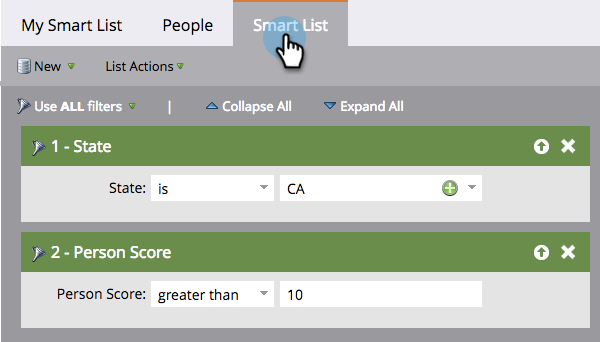

# 了解智能列表 {#understanding-smart-lists}

智能列表允许您使用简单过滤器查找特定人员组。 它们在Marketo中广泛使用，例如在智能营销活动、项目、报表、分段、业务模型、参与项目、动态内容等中。 根据您的需求，可以在Marketo中的两个位置创建智能列表：

1. 在 **数据库**，可供共享/全局使用（例如，“所有已取消订阅的人员”）。
1. 在 **程序** 作为本地资产，负责查找与该特定计划相关的一组人员（例如“参加贸易展”）。

创建智能列表的主要步骤包括：

1. [创建智能列表](/help/marketo/product-docs/core-marketo-concepts/smart-lists-and-static-lists/creating-a-smart-list/create-a-smart-list.md)
1. [查找筛选器并将其添加到智能列表](/help/marketo/product-docs/core-marketo-concepts/smart-lists-and-static-lists/creating-a-smart-list/find-and-add-filters-to-a-smart-list.md)
1. [定义智能列表筛选器](/help/marketo/product-docs/core-marketo-concepts/smart-lists-and-static-lists/creating-a-smart-list/define-smart-list-filters.md)

以下是智能列表的外观示例。

## 主选项卡 {#main-tab}

在这里，您可以 [编辑智能列表名称](/help/marketo/product-docs/core-marketo-concepts/miscellaneous/rename-a-marketo-asset.md) 并查看有关智能列表的信息。

## “人员”选项卡 {#people-tab}

您可以在此处查看结果；例如，所有符合您筛选条件的人员 [已添加和定义](/help/marketo/product-docs/core-marketo-concepts/smart-lists-and-static-lists/creating-a-smart-list/find-and-add-filters-to-a-smart-list.md) 在“智能列表”选项卡下。

## “智能列表”选项卡 {#smart-list-tab}

您可以添加和定义过滤器，以在“人员”选项卡中查看特定人员组。

好，我们开始吧！

>[!MORELIKETHIS]
>
>* [使用内置/系统智能列表](/help/marketo/product-docs/core-marketo-concepts/smart-lists-and-static-lists/using-smart-lists/use-built-in-system-smart-lists.md)
>* [创建智能列表](/help/marketo/product-docs/core-marketo-concepts/smart-lists-and-static-lists/creating-a-smart-list/create-a-smart-list.md)
