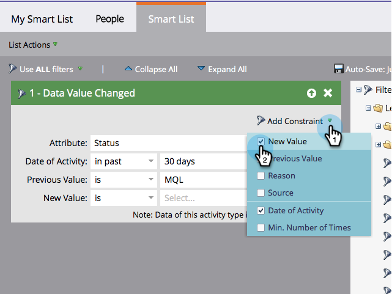

# 向智能列表筛选器添加约束 {#add-a-constraint-to-a-smart-list-filter}

创建智能列表时，某些过滤器具有称为“约束”的高级选项。 这些是可添加到筛选器和触发器的额外条件，有助于进一步缩小搜索范围。

在本例中，让我们添加一些限制到 **[数据值已更改](/help/marketo/product-docs/core-marketo-concepts/smart-campaigns/flow-actions/change-data-value.md)** 筛选以查找状态从MQL更改为SQL的人员。

>[!PREREQUISITES]
>
>* [创建智能列表](/help/marketo/product-docs/core-marketo-concepts/smart-lists-and-static-lists/creating-a-smart-list/create-a-smart-list.md)
>* [在智能列表中使用“数据值已更改”筛选器](/help/marketo/product-docs/core-marketo-concepts/smart-lists-and-static-lists/using-smart-lists/use-the-data-value-changed-filter-in-a-smart-list.md)
>

1. 转到 **营销活动**.

   

1. 选择带有要向其添加约束的过滤器的智能列表，然后单击 **智能列表** 选项卡。

   

1. 下 **添加约束**，选择 **上一个值**.

   

1. 输入 **上一个值**. 在此示例中，我们使用的是MQL。

   

1. 下 **添加约束**，选择 **新值**.

   

1. 输入 **新值**. 在本例中，我们使用的是SQL。

   

1. 做得好！ 单击 **人员** 选项卡，查看所有具有 **状态** 更改自 **MQL** 到 **SQL** 在过去30天内。
