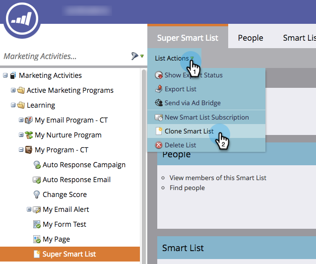

# 克隆列表或智能列表 {#clone-a-list-or-smart-list}

通过克隆类似列表并进行更改，可节省一些时间，而不是从头开始创建智能列表。 这是方法。

1. 转到 **营销活动**.

   

1. 选择要克隆的智能列表。

   

1. 在 **列出操作**，单击 **克隆智能列表**.

   

1. 输入 **名称** 单击 **克隆**.

   

干得好！ 您也可以以相同方式克隆常规列表。
