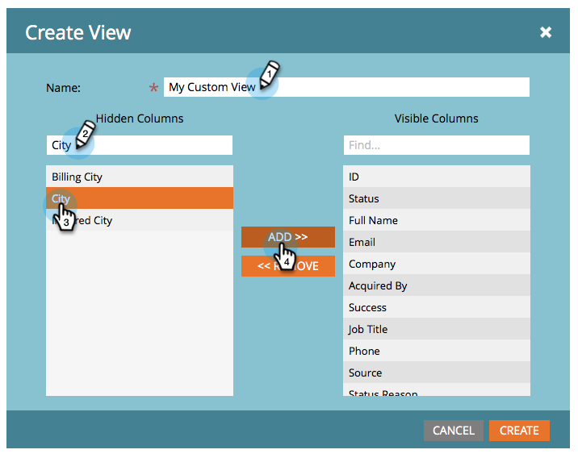

# 创建和更改列表和智能列表的视图 {#create-and-change-views-for-lists-and-smart-list}

智能列表显示一组默认列。 你知道你可以把这些栏编辑成你心中的内容吗？ 具体方法如下。

## 创建视图 {#create-a-view}

1. 转到列表或智能列表，单击&#x200B;**[!UICONTROL 人员]**&#x200B;选项卡，然后单击&#x200B;**[!UICONTROL 视图]**&#x200B;下拉列表下的&#x200B;**[!UICONTROL 创建视图]**。

   

1. 命名视图并查找要添加或删除的列。

   

1. 添加/删除所需的列，然后单击&#x200B;**[!UICONTROL 创建]**。

   

>[!TIP]
>
>若要快速搜索，请使用&#x200B;**查找**&#x200B;框。

## 切换视图 {#switch-views}

1. 单击&#x200B;**[!UICONTROL 视图]**&#x200B;下拉列表，然后选择所需的视图。 根据需要在不同视图之间来回切换。

   

>[!NOTE]
>
> 为了切换视图，除了默认视图之外，必须首先创建第二个视图。

## 编辑视图 {#edit-a-view}

1. 确保在&#x200B;**[!UICONTROL 视图]**&#x200B;下拉菜单中选择要编辑的视图。

   

1. 单击&#x200B;**[!UICONTROL 编辑]**&#x200B;选项。

   

1. 进行所需的更改，然后单击&#x200B;**[!UICONTROL 保存]**。

   

## 删除视图 {#delete-a-view}

1. 从&#x200B;**[!UICONTROL 视图]**&#x200B;下拉列表中选择要删除的视图的&#x200B;**[!UICONTROL 编辑]**&#x200B;选项。

   

1. 单击&#x200B;**[!UICONTROL 删除]**。

   

只有您才能在“视图”下拉列表中看到您创建的自定义视图，因此请告知您的朋友他们需要创建自己的视图！

>[!MORELIKETHIS]
>
>* [使用内置/系统智能列表](/help/marketo/product-docs/core-marketo-concepts/smart-lists-and-static-lists/using-smart-lists/use-built-in-system-smart-lists.md){target="_blank"}
>* [创建智能列表](/help/marketo/product-docs/core-marketo-concepts/smart-lists-and-static-lists/creating-a-smart-list/create-a-smart-list.md){target="_blank"}
