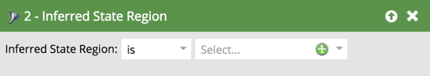

# 推断的筛选器 {#inferred-filters}

当有人访问您的网站时，[Munchkin](/help/marketo/product-docs/administration/additional-integrations/add-munchkin-tracking-code-to-your-website.md){target="_blank"}会对其进行Cookie并将其放入系统中。 我们在一个特殊的数据库中查找他们的IP并推断出各种信息。

>[!NOTE]
>
>为确保推断的字段值保持最新，我们会定期更新用于IP地址查找的数据库。 数据库更新可能会引入新的推断字段值，您可能需要将这些值添加到智能列表筛选器定义中。
>
>在[Marketo Engage的产品版本](/help/marketo/release-notes/release-schedule.md){target="_blank"}期间可能会进行数据库更新。 当更新发生时，[Marketo Engage发行说明](/help/marketo/release-notes/current.md){target="_blank"}将包含对推断字段值所做任何更改的解释。

当您在智能列表中使用这些筛选器时，结果将产生具有此推断信息的用户。

>[!TIP]
>
>在Web活动报表中使用这些过滤器。 使用销售代表的区域，让销售代表订阅过去24小时内有网站访客的自定义每日报表。 他们会喜欢的！
>
>* 已访问网页 — 过去24小时
>* 推断的状态是[选择其地区]

这些匿名访客在单击电子邮件链接或填写表单时，会自动转换为人员。 但是，它们会保留所有推断出的信息。

>[!NOTE]
>
>了解有关[匿名活动和潜在客户](/help/marketo/product-docs/core-marketo-concepts/smart-lists-and-static-lists/managing-people-in-smart-lists/understanding-anonymous-activity-and-people.md){target="_blank"}的更多信息。
