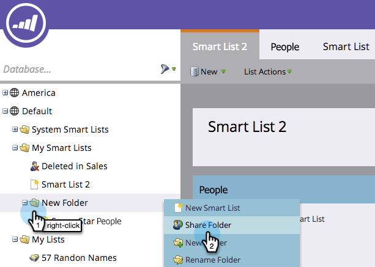

# 跨工作区引用列表或智能列表 {#reference-a-list-or-smart-list-across-workspaces}

列表和智能列表可以跨工作区共享和引用，以便从数据库轻松重用。

>[!NOTE]
>
>人员分区规则适用(工作区中的智能列表和静态列表仅显示同时是该列表成员的人员 *和* 成员)。

## 共享列表或智能列表  {#share-a-list-or-smart-list}

1. 转到 **数据库**.

   

1. 右键单击活动文件夹。 选择 **新建文件夹**.

   >[!NOTE]
   >
   >仅当资源嵌套在文件夹中时，才能在工作区之间共享资源。

   

1. 将要共享的列表或智能列表拖放到新文件夹中。

   

1. 右键单击 **新建文件夹** 并选择 **共享文件夹**.

   

1. 选择 **工作区** 以共享。 选择 **保存**.

   

   太棒了！ 现在，此列表在两个工作区中均可用。

   >[!NOTE]
   >
   >在营销活动中，只能共享顶级文件夹。 在数据库中，您可以共享顶级文件夹以及下一级文件夹。
