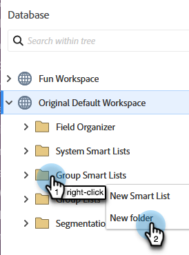
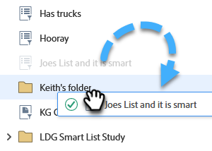

# 跨工作区引用列表或智能列表 {#reference-a-list-or-smart-list-across-workspaces}

列表和智能列表可以跨工作区共享和引用，以便从数据库轻松重用。

>[!NOTE]
>
>人员分区规则适用（工作区中的智能列表和静态列表仅显示同时属于当前工作区列表&#x200B;_和_&#x200B;成员的人员）。

## 共享列表或智能列表 {#share-a-list-or-smart-list}

1. 转到&#x200B;**[!UICONTROL Database]**。

   

1. 右键单击活动文件夹。 选择 **[!UICONTROL New Folder]**。

   

   >[!NOTE]
   >
   >如果Assets嵌套在文件夹中，则只能在工作区之间共享。

1. 为文件夹命名，然后点击 **[!UICONTROL Create]**。

   

1. 将要共享的列表或智能列表拖放到新文件夹中。

   

1. 右键单击新文件夹并选择&#x200B;**[!UICONTROL Share folder]**。

   

1. 选择要共享的&#x200B;**[!UICONTROL Workspace]**，然后单击&#x200B;**[!UICONTROL Save]**。

   

   太棒了！ 现在，此列表在两个工作区中均可用。

   >[!NOTE]
   >
   >在营销活动中，只能共享顶级文件夹。 在数据库中，您可以共享顶级文件夹以及下一级文件夹。
