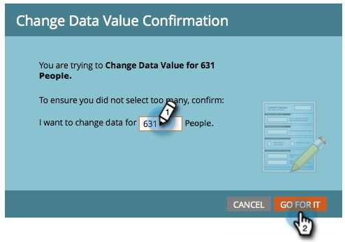
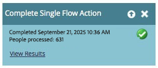

# 从智能列表中运行单流程步骤 {#run-a-single-flow-step-from-a-smart-list}

如果要运行一次性的仅流程步骤，则可以在智能列表中使用单个流程步骤，而不是创建整个智能营销活动。

>[!PREREQUISITES]
>
>[创建智能列表](/help/marketo/product-docs/core-marketo-concepts/smart-lists-and-static-lists/creating-a-smart-list/create-a-smart-list.md){target="_blank"}

1. 转到&#x200B;**[!UICONTROL 营销活动]**。

   

1. 选择一个列表或包含人员的智能列表，然后转到&#x200B;**[!UICONTROL 人员]**&#x200B;选项卡。

   

   >[!TIP]
   >
   >静态列表和智能列表均具有此功能。

1. 单击&#x200B;**[!UICONTROL 全选]**。 您还可以使用&#x200B;**Ctrl/Cmd**&#x200B;并单击以手动选择一些记录。

   

   >[!NOTE]
   >
   >如果结果跨越多个页面，则单击&#x200B;**[!UICONTROL 全选]**&#x200B;将选择所有页面上的所有人。

1. 在&#x200B;**[!UICONTROL 人员操作]**&#x200B;下，选择您选择的流程步骤。 在此示例中，我们将使用[更改数据值](/help/marketo/product-docs/core-marketo-concepts/smart-campaigns/flow-actions/change-data-value.md){target="_blank"}。

   

1. 查找并选择&#x200B;**[!UICONTROL 属性]**。 在此示例中，我们将接受所有拥有州“加利福尼亚”的人员，并将其更改为“CA”。

   

1. 输入新值。 单击&#x200B;**[!UICONTROL 立即运行]**。

   

1. 如果要更改大量人员的数据值，您可能需要通过键入数字来确认更改。 单击&#x200B;****。

   

做得很棒！ 您将在右上角看到单流程步骤的状态。

完成后，刷新列表，您将看到更新的信息。
