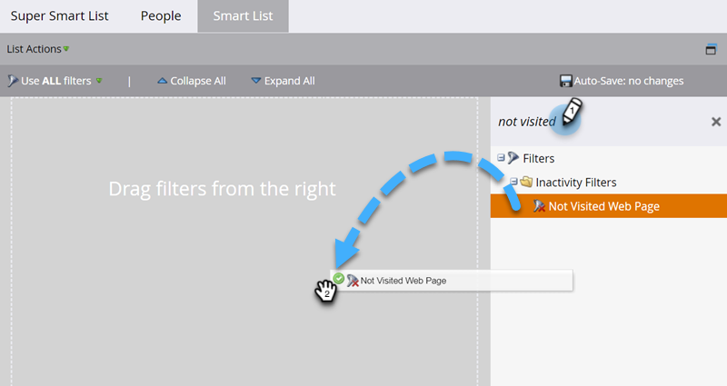
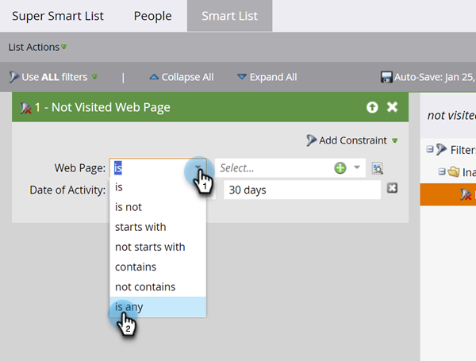

# 在智能列表中使用非活动筛选器 {#use-inactivity-filters-in-a-smart-list}

您是否知道可以在智能列表中查找那些&#x200B;_没有_&#x200B;执行任何操作的人员？ 查看这些非活动筛选器。

1. 转到&#x200B;**[!UICONTROL 营销活动]**。

   

1. 选择要编辑的智能列表，然后单击&#x200B;**[!UICONTROL 智能列表]**&#x200B;选项卡。

   

1. 查找您选择的非活动筛选器并将其拖到画布中。 例如，我们查找尚未访问过您任何页面的人员。

   

   >[!TIP]
   >
   >**[!UICONTROL 非活动筛选器]**&#x200B;文件夹中有许多筛选器。 搜索“Not”并查看它们。

1. 选择&#x200B;**[!UICONTROL 是any]**&#x200B;运算符。 这会查找过去30天内未访问任何页面的所有人员。

   
