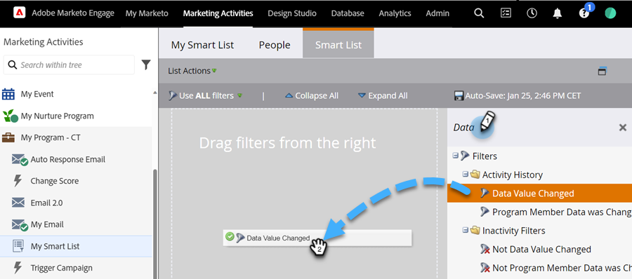

# 在智能列表中使用数据值更改过滤器 {#use-the-data-value-changed-filter-in-a-smart-list}

Marketo数据库中的值会不断更改和更新。 有时，您会希望查找价值发生更改的人员，而不是查找特定的值。

>[!PREREQUISITES]
>
>[创建智能列表](/help/marketo/product-docs/core-marketo-concepts/smart-lists-and-static-lists/creating-a-smart-list/create-a-smart-list.md){target="_blank"}

1. 进入 **[!UICONTROL Marketing Activities]** 区域。

   

1. 选择智能列表并单击&#x200B;**[!UICONTROL Smart List]**&#x200B;选项卡。

   

1. 找到&#x200B;**[!UICONTROL Data Value Changed]**&#x200B;筛选器并将其拖动到画布上。

   

1. 将&#x200B;**[!UICONTROL Attribute]**&#x200B;设置为要查找数据值更改的字段。

   

此过滤器将查找其状态发生更改（任何更改）的所有人员。 如果您希望获得更理想的体验，请尝试[向智能列表筛选器添加约束](/help/marketo/product-docs/core-marketo-concepts/smart-lists-and-static-lists/using-smart-lists/add-a-constraint-to-a-smart-list-filter.md){target="_blank"}。
