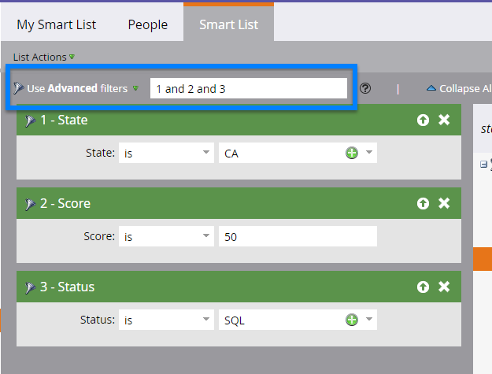

# 使用高级智能列表规则逻辑 {#using-advanced-smart-list-rule-logic}

通过将智能列表规则逻辑应用于智能列表中的多个过滤器，您可以找到所需的确切人员。 这是方法。

>[!PREREQUISITES]
>
>* [查找过滤器并将其添加到智能列表](/help/marketo/product-docs/core-marketo-concepts/smart-lists-and-static-lists/creating-a-smart-list/find-and-add-filters-to-a-smart-list.md)
>* [定义智能列表过滤器](/help/marketo/product-docs/core-marketo-concepts/smart-lists-and-static-lists/creating-a-smart-list/define-smart-list-filters.md)

>[!NOTE]
>
>仅当智能列表中有三个或更多个过滤器时，高级过滤器逻辑才可用。

## 将逻辑添加到智能列表 {#add-logic-to-a-smart-list}

默认情况下，您的智能列表将查找匹配 **全部** 过滤器(过滤器1 _和_ 2 _和_ 3)。 您可以更改规则逻辑以查找匹配的人员 **任意** 定义过滤器(过滤器1 _或_ 2 _或_ 3)，或使用高级过滤器(过滤器1 _和_ 2 _或_ 3)。

在此示例中，假设您想要在加利福尼亚找到人 _和_ 得分至少50分 _或_ 状态为“销售合格”。

1. 选择 **使用高级过滤器** 从下拉菜单中。

   

   >[!NOTE]
   >
   >使用 **高级** 过滤器减少了使用智能列表成员过滤器创建智能列表的需要。 这有助于优化性能。

1. 的 **高级过滤器** 文本框将在所有过滤器之间显示“和”作为默认值。

   

1. 在“2”和“3”周围键入一对圆括号。

   

   >[!CAUTION]
   >
   >输入规则逻辑时，必须在“或”之前使用“和”。

1. 将“2”和“3”之间的“和”更改为“或”。

   

## 混合“和”和“或”时使用圆括号 {#use-parentheses-when-mixing-and-and-or}

混合使用“和”和“或”逻辑需要用圆括号来明确您的意图。

## 如果需要，可将嵌套的圆括号用于四个或更多过滤器 {#use-nested-parentheses-for-four-or-more-filters-if-needed}

根据您的意图，在使用四个或更多过滤器时，您可能需要添加嵌套的圆括号。

>[!TIP]
>
>如果输入的规则无效，您将在规则下看到一个红线。 滚动到文本上可查看相关的错误消息。
