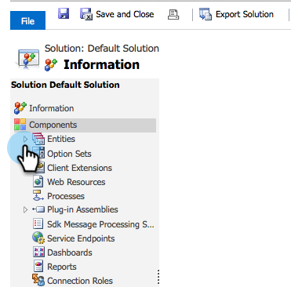

# 创建自定义Dynamics同步过滤器 {#create-a-custom-dynamics-sync-filter}

不想将Dynamics CRM中的所有内容同步到Marketo? 别担心！ Marketo允许您设置同步过滤器，并仅同步部分记录。

## 概述 {#overview}

要设置Dynamics同步筛选器，请执行以下操作：

1. 在Dynamics CRM中为任何对象（潜在客户、联系人、帐户、业务机会和其他自定义实体）创建名为new_synctomkto的自定义两个选项（布尔）字段。
1. 为此字段指定“是”/“否”值，或将其留空。

>[!NOTE]
>
>您必须在Dynamics CRM中进行这些更改，而不是在数据库或Marketo中进行。

Marketo在自动后台同步期间查找此字段，并根据以下逻辑确定要同步的记录：

| 字段值 | 同步到Marketo? |
|---|---|
| 字段不存在 | 是 |
| 字段为空 | 是 |
| 字段的值为Yes | 是 |
| 字段的值为No | 否 |

>[!CAUTION]
>
>要告知Marketo跳过记录，唯一的方法是将字段值明确设置为 **否**. 即使字段值为空，Marketo仍会同步记录。

>[!PREREQUISITES]
>
>安装最新版本的Marketo插件（3.0.0.1或更高版本）。 转到Marketo >管理员> Microsoft Dynamics >下载Marketo解决方案。

## 创建SyncToMkto字段 {#create-synctomkto-field}

1. 登录Dynamics CRM。 单击 **设置** 然后单击 **自定义**.

   

1. 单击 **自定义系统**.

   

1. 单击  下一页 **实体**.

   

1. 单击  下一页 **商机** 选择 **字段**. 然后，单击 **新建**.

   

1. 输入 **SyncToMkto** 在 **显示名称** 字段和选择 **两个选项** 作为 **数据类型**. 然后，单击 **保存并关闭**.

   

   >[!NOTE]
   >
   >为此字段选择任何显示名称，但“名称”字段必须精确 **new_synctomkto**. 您必须使用 **新建** 作为默认前缀。 如果已更改默认设置，请转到 [重置自定义字段名称的默认前缀](/help/marketo/product-docs/crm-sync/microsoft-dynamics-sync/create-a-custom-dynamics-sync-filter/set-a-default-custom-field-prefix.md). 在创建新字段后，您可以重新更改它。

   >[!NOTE]
   >
   >如果您设置了异步工作流，记录将获取您在字段中设置的默认SyncToMkto值，并在工作流完成运行后几秒钟后获得正确的值。 如果将默认值设置为“是”，则这些记录将在Marketo中创建，然后失效。 使用 **否** 作为默认值来避免出现此问题。

1. 重复此过程并创建 **SyncToMkto** 字段，用于您希望限制同步的任何其他实体，例如联系人、帐户、机会和自定义实体。

## 在Marketo中选择过滤器 {#select-the-filter-in-marketo}

即使您已经完成初始同步，请进入并选择要与Marketo同步的字段。

1. 转到“管理员”并选择 **Microsoft Dynamics**.

   

1. 单击 **编辑** 在字段同步详细信息中。

   

1. 向下滚动到字段并对其进行检查。 实际名称必须是new_synctomkto，但“显示名称”可以是任何内容。 单击 **保存**.

   

很好，现在您已为Marketo启用同步筛选器。

## 创建Dynamics工作流以自动分配同步筛选器值 {#create-a-dynamics-workflow-to-assign-sync-filter-values-automatically}

您始终可以为记录手动为SyncToMkto字段分配值。 但是，在创建或更新记录时，为什么不利用Dynamics工作流的强大功能，自动为SyncToMkto字段分配值？

>[!NOTE]
>
>无法在数据库级别执行此操作。 必须在CRM中手动或使用工作流完成。
>
>Dynamics工作流仅适用于将来创建的新记录，而不适用于历史数据。 使用批更新来移动现有记录。

1. 转到Dynamics CRM。 单击 **设置** 然后单击 **流程**.

   

1. 单击 **新建**.

   

1. 输入工作流的名称，然后选择 **工作流** 作为类别和 **商机** 作为实体。 然后，单击 **确定**.

   

1. 创建规则以为 **SyncToMkto** 字段。 单击 **保存并关闭**.

   

   >[!NOTE]
   >
   >在单击 **添加步骤** 添加检查条件。 这会设置您不希望同步到的记录 **否**. 否则，它们将同步。

1. 选择工作流并单击 **激活**.

   

   >[!TIP]
   >
   >请参阅 [电子邮件地址的自定义同步过滤器规则](/help/marketo/product-docs/crm-sync/microsoft-dynamics-sync/create-a-custom-dynamics-sync-filter/custom-sync-filter-rules-for-an-email-address.md) 以设置规则，以便仅同步具有电子邮件地址的人员的记录。

## 同步过滤器详细信息 {#sync-filter-details}

以下是我们认为您应该了解的一些实施详细信息：

1. 启动同步操作

   当 **SyncToMkto** 值更改 **否** to **是**,Dynamics会通知Marketo立即开始同步此记录。 如果记录已存在，则Marketo会更新该记录。 否则，Marketo会创建记录。

   >[!TIP]
   >
   >A `Create [StartSync]` 操作会添加到Marketo日志中。

1. 停止同步操作

   当记录将其SyncToMkto值从“是”更改为“否”时，将通知Marketo停止同步此记录。 但是，该记录并未删除，反而会停止获取更新，变得陈旧。

>[!MORELIKETHIS]
>
>* [Microsoft Dynamics同步过滤器：确定](/help/marketo/product-docs/crm-sync/microsoft-dynamics-sync/create-a-custom-dynamics-sync-filter/microsoft-dynamics-sync-filter-qualify.md)
>* [Microsoft Dynamics同步过滤器：合并](/help/marketo/product-docs/crm-sync/microsoft-dynamics-sync/create-a-custom-dynamics-sync-filter/microsoft-dynamics-sync-filter-merge.md)
>* [电子邮件地址的自定义同步过滤器规则](/help/marketo/product-docs/crm-sync/microsoft-dynamics-sync/create-a-custom-dynamics-sync-filter/custom-sync-filter-rules-for-an-email-address.md)

