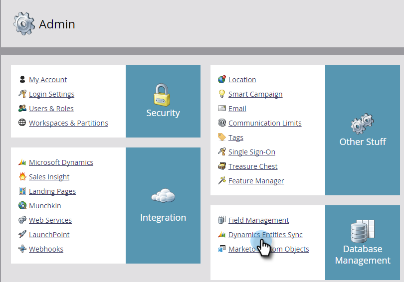

# 为自定义实体启用同步 {#enable-sync-for-a-custom-entity}

如果您需要来自[!DNL Dynamics]的自定义实体数据才能在Marketo Engage中使用，以下是如何为其启用同步。

>[!PREREQUISITES]
>
>要使用自定义对象，必须将其关联到Microsoft Dynamics中的[潜在客户](/help/marketo/product-docs/crm-sync/microsoft-dynamics-sync/microsoft-dynamics-sync-details/microsoft-dynamics-sync-lead-sync.md){target="_blank"}、[联系人](/help/marketo/product-docs/crm-sync/microsoft-dynamics-sync/microsoft-dynamics-sync-details/microsoft-dynamics-sync-contact-sync.md){target="_blank"}或[帐户](/help/marketo/product-docs/crm-sync/microsoft-dynamics-sync/microsoft-dynamics-sync-details/microsoft-dynamics-sync-account-sync.md){target="_blank"}对象。

>[!NOTE]
>
>* 为自定义实体启用同步后，Marketo会执行初始同步，以引入自定义对象的所有数据。
>* 当前不支持&#x200B;_营销列表和营销列表成员_。

>[!IMPORTANT]
>
>Marketo同步用户需要具有自定义对象的读取权限才能列出该自定义对象并对其执行同步。

1. 转到&#x200B;**[!UICONTROL Admin]**&#x200B;部分。

   

1. 选择 **[!UICONTROL Microsoft Dynamics]** 并点击 **[!UICONTROL Disable Sync]**。

   

   >[!NOTE]
   >
   >必须暂时禁用全局同步才能启用或禁用自定义实体。

1. 在[!UICONTROL Database Management]下，单击&#x200B;**[!UICONTROL Dynamics Entities Sync]**&#x200B;链接。

   

1. 单击&#x200B;**[!UICONTROL Sync schema]**&#x200B;链接。

   

1. 选择要同步的实体并单击&#x200B;**[!UICONTROL Enable Sync]**。

   

1. 选择要同步或用作智能列表中的[约束](/help/marketo/product-docs/core-marketo-concepts/smart-lists-and-static-lists/using-smart-lists/add-a-constraint-to-a-smart-list-filter.md)和/或触发器的字段。 完成后，单击&#x200B;**[!UICONTROL Enable Sync]**。

   

   >[!NOTE]
   >
   >在同步过程中，您可能会注意到“[!UICONTROL Dynamic Entities Sync]”项从导航树中消失。 这是预期行为，同步完成后它将重新显示。

1. 实体现在具有绿色复选标记。

   

1. 不要忘记重新启用全局同步！

   

   >[!NOTE]
   >
   >* Marketo仅支持链接到一到两级深度标准实体的自定义实体。
   >
   >* 自定义对象树可以多次显示同一对象，因为它与主要对象之一（例如，潜在客户、联系人或帐户，或通过中间对象间接连接）的直接连接。 在这种情况下，请选择最接近主对象的对象，然后只选择一个对象。 多次选择同一对象可能会妨碍该自定义对象的同步。
