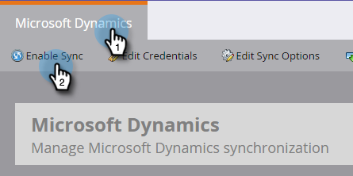

# Microsoft Dynamics同步：自定义实体同步{#microsoft-dynamics-sync-custom-entity-sync}

如果您需要启用初始自定义实体同步，以使Marketo中的Dynamics数据可用，请看如何操作。

>[!NOTE]
>
>**需要管理权限**

>[!PREREQUISITES]
>
>要使用自定义对象，它必须与Dynamics中的[lead](/help/marketo/product-docs/crm-sync/microsoft-dynamics-sync/microsoft-dynamics-sync-details/microsoft-dynamics-sync-lead-sync.md)、[contact](/help/marketo/product-docs/crm-sync/microsoft-dynamics-sync/microsoft-dynamics-sync-details/microsoft-dynamics-sync-contact-sync.md)或[account](/help/marketo/product-docs/crm-sync/microsoft-dynamics-sync/microsoft-dynamics-sync-details/microsoft-dynamics-sync-account-sync.md)对象关联。

>[!CAUTION]
>
>在开始自定义实体的同步之前，请确保完成初始同步（将通过电子邮件通知您）。

1. 转至“管理员”部分。

   

1. 单击&#x200B;**禁用同步**&#x200B;可暂时禁用标准全局同步。

   

1. 安装支持自定义实体同步的Microsoft Dynamics版本(2_0_0_2后)。 请参阅[Marketo Plugin Releases for MIcrosoft Dynamics](/help/marketo/product-docs/crm-sync/microsoft-dynamics-sync/marketo-plugin-releases-for-microsoft-dynamics.md)。

1. 为Marketo Sync用户授予您计划同步的任何实体的读取权限。

1. 在“数据库管理”下，单击&#x200B;**Dynamics Entities Sync**&#x200B;链接。

   

1. 单击&#x200B;**同步模式**&#x200B;链接，以启用可用自定义实体的列表。

   

1. 在列表同步后，选择要同步的字段和要在智能列表中用作[constraints](/help/marketo/product-docs/core-marketo-concepts/smart-lists-and-static-lists/using-smart-lists/add-a-constraint-to-a-smart-list-filter.md)和/或触发器的字段。 完成后，单击&#x200B;**启用同步**。

   

1. 重新启用全局同步。

   

   >[!NOTE]
   >
   >Marketo仅支持链接到标准实体的自定义实体（深度为一或两个级别）。

   >[!NOTE]
   >
   >实体名称最多可包含&#x200B;**33个字符**。

你很好！
