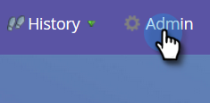
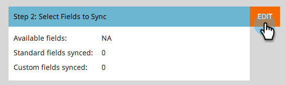

# 在Dynamics {#editing-fields-to-sync-before-deleting-them-in-dynamics}中删除之前，编辑要同步的字段

有时，您可能希望删除Dynamics中的字段。 Marketo将字段列表作为基于同步的引用。 如果在同步打开时在Dynamics中删除了字段，则同步可能会遇到错误。 在删除任何字段之前，请执行以下步骤。

1. 在Marketo中，单击&#x200B;**Admin**。

   

1. 在“集成”下，单击&#x200B;**Microsoft Dynamics**。

   

1. 单击&#x200B;**禁用同步**。

   

1. 在浏览器的新选项卡中，登录Dynamics并删除所需字段。

1. 返回Marketo，在Microsoft Dynamics下，单击“步骤2:选择要同步的字段。”****

   

1. 查看字段，然后单击&#x200B;**保存**。

   

>[!CAUTION]
>
>单击&#x200B;**保存**&#x200B;将保存已更新的同步模式，即使未进行任何更改也是如此。

>[!NOTE]
>
>如果在删除Dynamics中的字段之前未停止同步，则同步可能会遇到错误。 如果确实如此，同步将停止。 在恢复之前，Marketo管理员需要查看“选择要同步的字段”（上文讨论）并单击&#x200B;**保存**，以便同步接受模式更改。

请记住在保存更改后启用同步！
