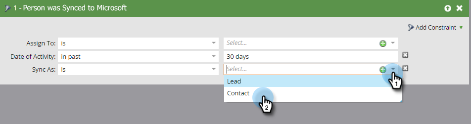

# 在Microsoft Dynamics中创建联系人 {#create-a-contact-in-microsoft-dynamics}

1. 选择要在Dynamics中创建为联系人的仅Marketo人员(Microsoft类型为空)。

   

1. 单击 **人员操作** 和 **Microsoft**，然后选择 **将人员同步到Microsoft**.

   

1. 单击 **同步方式** 选择 **联系人**. 单击 **立即运行**.

   

   >[!NOTE]
   >
   >使用“将人员同步到Microsoft”流程操作（仅在触发器促销活动中）时，将在Dynamics中实时创建潜在客户/联系人。

1. Marketo将Dynamics中的潜在客户记录限定为与Dynamics中的任何帐户都不关联的联系人。

   

1. 现在，您可以选择 **联系人** 在智能营销活动过滤器中使用“同步为”约束时。

   
