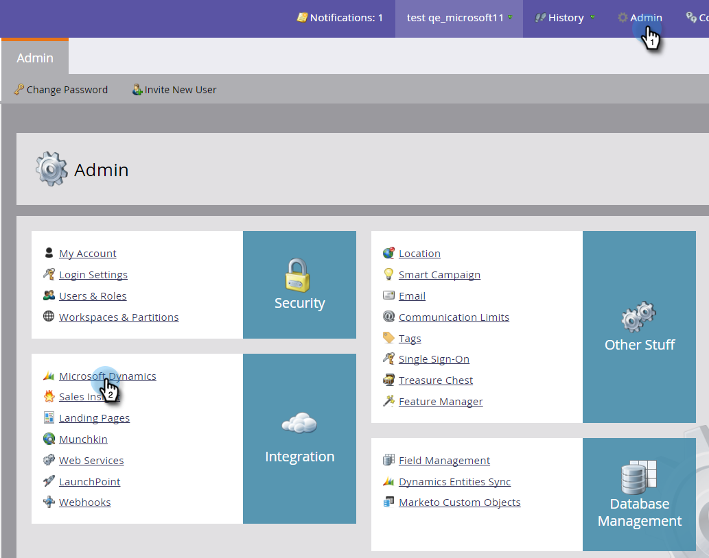

# 同步状态 {#sync-status}

您可以在“同步状态”和“同步错误”选项卡上记录同步进程的当前吞吐量和积压。

## “同步状态”选项卡 {#sync-status-tab}

1. 单击 **管理员** 和 **Microsoft Dynamics**.

   

1. 单击 **同步状态** 选项卡。

   

   此表显示每个对象尚未同步的插入和更新的积压。

1. 双击任意行可查看机会信息。

   

   同步状态详细信息按插入和更新以及最早的插入和更新记录进行细分。

   

1. 单击 **查看：** 下拉菜单并选择 **上一小时** 查看吞吐量信息。

   

   此时显示过去一整小时（例如，下午1-2点）内同步的记录数。

   

   >[!NOTE]
   >
   >查看“上一小时”视图时，“插入”和“更新”列显示为N/A。这是预期行为。

## “同步错误”选项卡 {#sync-errors-tab}

浏览、搜索或导出未能与操作、方向、错误代码和错误消息等详细信息同步的潜在客户（和其他对象）。

>[!MORELIKETHIS]
>
>[通知类型](/help/marketo/product-docs/core-marketo-concepts/miscellaneous/understanding-notifications/notification-types.md)
