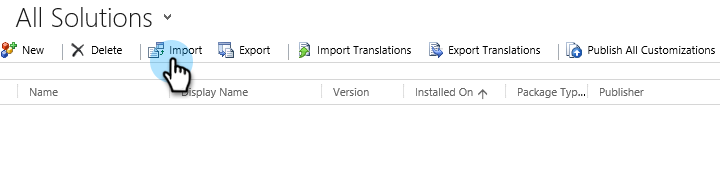

# 第1步（共3步）：在Dynamics中安装Marketo解决方案（2013年内部部署） {#step-of-install-the-marketo-solution-in-dynamics-on-premises}

在同步Microsoft Dynamics内部部署和Marketo Engage之前，您需要先在Dynamics中安装Marketo解决方案。

>[!NOTE]
>
>将Marketo同步到CRM后，如果不替换该实例，则无法执行新的同步。

>[!PREREQUISITES]
>
>必须配置了[Active Directory联合身份验证服务](https://msdn.microsoft.com/en-us/library/bb897402.aspx){target="_blank"} 2.0、2.1或3.0 (ADFS)的[面向Internet的部署](https://www.microsoft.com/en-us/download/confirmation.aspx?id=41701){target="_blank"} (IFD)。 注意：单击该链接时，会自动下载IFD文档。
>
>[在开始之前，请下载Marketo解决方案](/help/marketo/product-docs/crm-sync/microsoft-dynamics-sync/sync-setup/download-the-marketo-lead-management-solution.md){target="_blank"}。

>[!NOTE]
>
>**需要Dynamics管理员权限**。
>
>您需要CRM管理员权限才能执行此同步。

1. 登录Dynamics。 单击&#x200B;**[!UICONTROL Microsoft Dynamics CRM]**&#x200B;下拉菜单，然后选择&#x200B;**[!UICONTROL 设置]**。

   

1. 在&#x200B;**[!UICONTROL 设置]**&#x200B;下，选择&#x200B;**[!UICONTROL 解决方案]**。

   

1. 单击&#x200B;**[!UICONTROL 导入]**。

   

1. 单击&#x200B;**[!UICONTROL 浏览]**&#x200B;并选择[下载的解决方案](/help/marketo/product-docs/crm-sync/microsoft-dynamics-sync/sync-setup/download-the-marketo-lead-management-solution.md){target="_blank"}。 单击&#x200B;**[!UICONTROL 下一步]**。

   

1. 查看解决方案信息并单击&#x200B;**[!UICONTROL 查看解决方案包详细信息]**。

   

1. 检查完所有详细信息后，单击&#x200B;**[!UICONTROL 关闭]**。

   

1. 返回“解决方案信息”页面，单击&#x200B;**[!UICONTROL 下一步]**。

   

1. 确保选中SDK选项。 单击&#x200B;**[!UICONTROL 导入]**。

   

1. 等待导入完成。

   >[!TIP]
   >
   >您需要启用浏览器上的弹出窗口才能完成安装过程。

   

1. 下载日志文件（如果需要），然后单击&#x200B;**[!UICONTROL 关闭]**。

   >[!NOTE]
   >
   >您可能会看到一条消息，显示“Marketo潜在客户管理已完成，但有警告”。 这是完全符合预期的。

   

1. Marketo潜在客户管理现在将显示在&#x200B;**[!UICONTROL 所有解决方案]**&#x200B;页面上。

   

1. 选择Marketo解决方案，然后单击&#x200B;**[!UICONTROL Publish所有自定义项]**。

   

>[!CAUTION]
>
>禁用任何Marketo SDK消息传递过程都将导致安装中断！

>[!MORELIKETHIS]
>
>[第2步（共3步）：为Marketo配置同步用户（2013内部部署）](/help/marketo/product-docs/crm-sync/microsoft-dynamics-sync/sync-setup/connecting-to-legacy-versions/step-2-of-3-configure-2013.md){target="_blank"}
