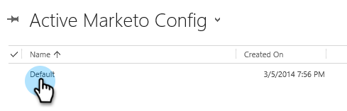

# 第2步（共3步）：为Marketo配置同步用户（2013年内部部署） {#step-of-configure-sync-user-for-marketo-on-premises}

出色完成了前面的步骤，让我们继续介绍这些步骤。

>[!PREREQUISITES]
>
>[第1步（共3步）：在 [!DNL Dynamics] 中安装Marketo解决方案（2013年内部部署）](/help/marketo/product-docs/crm-sync/microsoft-dynamics-sync/sync-setup/connecting-to-legacy-versions/step-1-of-3-install-2013.md)

## 分配同步用户角色 {#assign-sync-user-role}

仅将Marketo同步用户角色分配给Marketo同步用户。 您无需将其分配给任何其他用户。

>[!NOTE]
>
>这适用于Marketo插件版本4.0.0.14及更高版本。 对于早期版本，所有用户都必须具有同步用户角色。 要升级Marketo，请参阅[升级 [!DNL Microsoft Dynamics]](/help/marketo/product-docs/crm-sync/microsoft-dynamics-sync/sync-setup/update-the-marketo-solution-for-microsoft-dynamics.md)的Marketo解决方案。

>[!IMPORTANT]
>
>同步用户[的语言设置应设置为“英语](https://learn.microsoft.com/en-us/power-platform/admin/enable-languages){target="_blank"}”。

1. 在&#x200B;**[!UICONTROL Settings]**&#x200B;下，单击&#x200B;**[!UICONTROL Administration]**。

   

1. 选择 **[!UICONTROL Users]**。

   

1. 您将在此处看到用户列表。 选择您的专用Marketo同步用户或联系您的[Active Directory联合身份验证服务(AFDS)](https://msdn.microsoft.com/en-us/library/bb897402.aspx){target="_blank"}管理员以创建[专用于Marketo](https://blogs.technet.com/b/askpfeplat/archive/2014/04/21/introduction-to-active-directory-federation-services-ad-fs-alternateloginid-feature.aspx){target="_blank"}的新用户。

   

1. 选择同步用户。 单击并选择&#x200B;**[!UICONTROL Manage Roles]**

   

1. 检查&#x200B;**[!UICONTROL Marketo Sync User]**&#x200B;并单击&#x200B;**[!UICONTROL OK]**。

   

   >[!TIP]
   >
   >如果未看到该角色，请返回3[的](/help/marketo/product-docs/crm-sync/microsoft-dynamics-sync/sync-setup/connecting-to-legacy-versions/step-1-of-3-install-2013.md){target="_blank"}步骤1并导入解决方案。

   >[!NOTE]
   >
   >同步用户在CRM中所做的任何更新都&#x200B;_不会_&#x200B;同步回Marketo。

## 配置Marketo解决方案 {#configure-marketo-solution}

快完成了！ 在转到下一篇文章之前，我们仅做了最后几段配置。

1. 在&#x200B;**[!UICONTROL Settings]**&#x200B;下，单击&#x200B;**[!UICONTROL Marketo Config]**。

   

   >[!NOTE]
   >
   >如果&#x200B;**[!UICONTROL Marketo Config]**&#x200B;缺失，请尝试刷新页面。 如果问题仍然存在，请[再次发布Marketo解决方案](/help/marketo/product-docs/crm-sync/microsoft-dynamics-sync/sync-setup/connecting-to-legacy-versions/step-1-of-3-install-2013.md)或尝试注销并重新登录。

1. 单击 **[!UICONTROL Default]**。

   

1. 单击&#x200B;**[!UICONTROL Marketo User]**&#x200B;字段并选择同步用户。

   

1. 单击右下角的以保存更改。

   

1. 单击 **[!UICONTROL Publish All Customizations]**。

   

## 在继续执行步骤3之前 {#before-proceeding-to-step}

* 如果要限制同步记录数，请立即[设置自定义同步筛选器](/help/marketo/product-docs/crm-sync/microsoft-dynamics-sync/create-a-custom-dynamics-sync-filter.md)。
* 运行[验证 [!DNL Microsoft Dynamics] 同步](/help/marketo/product-docs/crm-sync/microsoft-dynamics-sync/sync-setup/validate-microsoft-dynamics-sync.md)进程。 它验证初始设置是否正确完成。
* 在[!DNL Microsoft Dynamics] CRM中登录Marketo同步用户。

做得好！

>[!MORELIKETHIS]
>
>[第3步（共3步）：连接Marketo和 [!DNL Dynamics] （2013年内部部署）](/help/marketo/product-docs/crm-sync/microsoft-dynamics-sync/sync-setup/connecting-to-legacy-versions/step-3-of-3-connect-2013.md)
