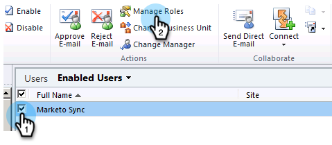

# 步骤2（共3步）：在Dynamics（2011本地版）中设置Marketo同步用户 {#step-of-set-up-marketo-sync-user-in-dynamics-on-premises}

完成上述步骤非常出色，让我们继续完成此步骤。

>[!PREREQUISITES]
>
>[步骤1（共3步）：安装Marketo解决方案（2011年内部部署版）](/help/marketo/product-docs/crm-sync/microsoft-dynamics-sync/sync-setup/connecting-to-legacy-versions/step-1-of-3-install-2011.md)

## 分配同步用户角色 {#assign-sync-user-role}

将Marketo同步用户角色仅分配给Marketo同步用户。 您无需将其分配给任何其他用户。

>[!NOTE]
>
>这适用于Marketo插件版本4.0.0.14及更高版本。 对于早期版本，所有用户都必须具有同步用户角色。 要升级Marketo，请参阅 [升级适用于Microsoft Dynamics的Marketo解决方案](/help/marketo/product-docs/crm-sync/microsoft-dynamics-sync/sync-setup/update-the-marketo-solution-for-microsoft-dynamics.md).

>[!IMPORTANT]
>
>同步用户的语言设置 [应设置为英语](https://portal.dynamics365support.com/knowledgebase/article/KA-01201/en-us).

1. 在左下角的菜单中，选择 **设置**.

   

1. 在树中，选择 **管理**.

   

1. 选择 **用户**.

   

1. 您将在此处看到用户列表。 选择您的专用Marketo同步用户或与 [Active Directory联合身份验证服务(AFDS)](https://msdn.microsoft.com/en-us/library/bb897402.aspx) 管理员来创建专用于Marketo的新用户。 单击 **管理角色**.

   

1. 检查 **Marketo同步用户** 单击 **确定**.

   

   >[!TIP]
   >
   >如果看不到角色，请返回 [步骤1 - 3](/help/marketo/product-docs/crm-sync/microsoft-dynamics-sync/sync-setup/connecting-to-legacy-versions/step-1-of-3-install-2011.md) 并导入解决方案。

   >[!NOTE]
   >
   >同步用户在CRM中进行的任何更新都将 **not** 同步回Marketo。

## 配置Marketo解决方案 {#configure-marketo-solution}

快完了！ 在转到下一篇文章之前，我们只需完成一些最后的配置。

1. 选择 **设置**. 然后选择 **Marketo配置** 在树上。

   

   >[!NOTE]
   >
   >如果Marketo配置缺失，请尝试刷新页面。 如果问题持续存在， [再次发布Marketo解决方案](/help/marketo/product-docs/crm-sync/microsoft-dynamics-sync/sync-setup/connecting-to-legacy-versions/step-1-of-3-install-2011.md) 或注销然后重新登录。

1. 单击 **默认**.

   

1. 单击 

   

1. 在弹出窗口中，选择同步用户。 然后，单击 **确定**.

   

1. 单击 **保存** 以保存更改。

   

1. 单击 **发布所有自定义设置**.

   

## 继续执行步骤3之前 {#before-proceeding-to-step}

    *如果要限制同步的记录数，请立即[设置自定义同步筛选器](/help/marketo/product-docs/crm-sync/microsoft-dynamics-sync/create-a-custom-dynamics-sync-filter.md)。
    *运行[验证Microsoft Dynamics同步](/help/marketo/product-docs/crm-sync/microsoft-dynamics-sync/sync-setup/validate-microsoft-dynamics-sync.md)进程。 它验证初始设置是否正确完成。
    *在Microsoft Dynamics CRM中登录Marketo同步用户。

干得好！

>[!MORELIKETHIS]
>
>[步骤3（共3步）：将Microsoft Dynamics与Marketo连接（2011年内部部署版）](/help/marketo/product-docs/crm-sync/microsoft-dynamics-sync/sync-setup/connecting-to-legacy-versions/step-3-of-3-connect.md)
